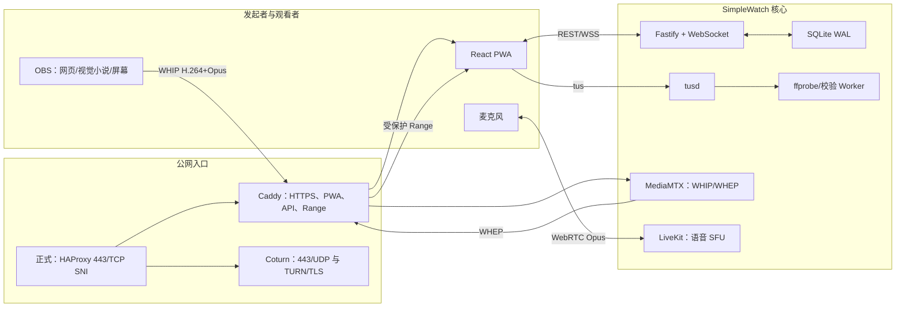

# SimpleWatch 私有同步观影系统全链路实施计划

> 文档版本：2.3（固定账户安全接入修订）
> 基准日期：2026-07-16
> 本地仓库：`/Users/simplechen/Desktop/Work/AllAI/SimpleWatch`
> 本地开发机：macOS arm64；项目工具链由仓库内 Conda 环境提供
> 目标服务器：阿里云轻量应用服务器，Ubuntu 22.04，2 vCPU、4 GiB、50 GiB 系统盘、标称 200 Mbps 峰值带宽、1 个公网 IPv4  
> 正式域名：`simplec.top`，完成个人 ICP 备案后启用  
> 文档性质：架构决策、实施规格、操作顺序和验收门禁的唯一上位文档

### 2026-07-16 已实施修订（优先于本文旧版对应条款）

本节是已落地的产品与部署决策；本文后续的历史架构说明应以本节和实际契约为准：

- 根路径统一显示标准账户登录页，支持浏览器密码管理器的 `username` / `current-password` 自动填充。
- 仅预置 `Host` 放映管理员和五个固定观影账户，不开放网页注册；账户名同时是不可修改的观影席名称。
- 使用 Argon2id 加服务端 pepper 保存密码，不保存或记录明文。会话采用 7 日闲置滑动期限、30 日绝对期限和 24 小时不透明令牌轮换。
- `Host` 登录后进入放映控制；观影账户登录后自动进入唯一活动房间。无房间或满员时进入实时等候页，房间开放后自动尝试入席。
- 房间共五席且 Host 占一席。同一账户允许多设备登录，但只有最新接管设备持有观影、语音和媒体权限，旧设备保留账户登录并显示被接管状态。
- 后台持续显示活动房间人数、节目模式、当前影片或 OBS 发布状态，并提供强制关闭房间、撤销会话和清退 RTC 连接的控制。
- 浏览器上传入口不强制宣称编码或帧率；显示进度、实时上传速度和预计剩余时间，并可终止单次上传及清理临时数据。
- H.264/H.265 MP4 均可入库。H.265 只在终端原生支持时直接播放，不支持时明确提示；服务器只允许无损重封装为 `hvc1`/faststart，不做视频转码。
- OBS/WHEP 节目播放与麦克风语音解耦；直播状态由 MediaMTX 控制 API 探测，发布恢复后客户端自动连接或重连。
- 域名尚未备案时，生产入口使用 `https://8.134.239.34` 的公开受信 IP 短期证书；Certbot 每 12 小时检查续签，证书变化后原子安装并平滑重启 Caddy。证书续签只解决 HTTPS 信任，不替代备案。
- 部署时彻底清空既有房间、片库、字幕、上传、检片任务和相关文件；验收产生的测试数据也必须在交付前再次清空。

上述实现由 `migrations/007_fixed_accounts.sql`、应用契约、前端页面、服务器 Compose、`tools/server/deploy-ip-test.sh` 和 `tools/server/ip-cert.sh` 共同约束，并由集成、安全、媒体、Worker、浏览器及线上协议测试验收。

## 0. 如何使用本文档

上一版文档与原始方案在技术方向上对应，但只够作为“架构与验收纲要”，不能让第一次接触项目的实施者从空仓库直接做到全链路可用。第二版补齐了以下阻断项：

- 可复核的服务器基线和 No-Go 条件。
- 合法、隔离、可复现的本地 Conda 与 pnpm 方案。
- 临时 IP 与正式域名两套互斥的 Compose 拓扑和端口所有权。
- Caddy、HAProxy、MediaMTX、LiveKit、Coturn、tusd 的连接关系。
- SQLite 表结构、REST/WS 契约、房间和主持权状态机。
- VOD、SFTP、tus、OBS、WHEP 和语音的鉴权闭环。
- 证书申请、续期、443 切换、监控、备份和安全回滚。
- 从第 0 阶段到正式域名上线的逐阶段产物、验证命令和放行条件。

实施规则：

1. 按第 18 章阶段顺序执行，不得跨过未通过的门禁。
2. 本文的“锁定决策”不得由实施者临时改写；确需变更时先形成 ADR，并同步修改接口、配置和验收项。
3. 配置、脚本和代码的最终值以 Git 中的实现为准；本文规定它们必须提供的文件、输入、输出和不变量。
4. 所有未决占位符、示例域名、未锁定镜像 digest 和默认密码在进入服务器部署前必须归零。CI 中设置 `pnpm plan:lint` 阻止这些内容进入发布包；本文明确标注为“实施时安全采集”的输入除外。
5. “全链路跑通”指功能和协议完整可用；2C4G 主机能否稳定承载 3–4 路 1080p，必须以真实晚高峰容量门禁为准，不能仅凭标称 200 Mbps 承诺。

当前交付边界：仓库已包含应用源码、Compose、Caddyfile、迁移、测试与部署脚本；能否宣告生产完成，仍取决于第18、19章门禁和本节新增的线上可信证书、单房间流程及最终空片库验收。

## 1. 原始需求与实现逐项对应

| 原始需求 | 锁定实现 | 验收证据 |
|---|---|---|
| 服务器本地影片，1080p30，3–4 名观看者 | 兼容 MP4 由 Caddy 同源鉴权后直接 HTTP Range 分发；Fastify 只鉴权和生成短期内容 URL，不搬运视频字节 | 共4个同时播放端（主持人+3成员），8 Mbps VOD 连续2小时；第5人可同时仅语音；206/416、拖动、迟到加入和同步偏差通过 |
| B 站等网页视频 | 不抓取、不下载平台内容；发起者用 OBS 捕获浏览器窗口与系统音频，经 WHIP 推送 | Windows/macOS OBS 各完成 1080p30、8 Mbps、60 分钟测试 |
| 视觉小说和本地电脑屏幕 | OBS 游戏/窗口捕获，硬件 H.264、Opus 双声道，经 MediaMTX 转发 | 文字清晰度、帧率、端到端延迟和左右声道测试通过 |
| 同步、低延迟观看 | VOD 使用服务器播放锚点和时钟校准；直播使用 WHIP/WHEP WebRTC，不增加 HLS/直播平台延迟 | VOD 多端偏差 p95 ≤350 ms；直播 WHEP 延迟 p95 ≤1.2 s |
| 视频音频至少立体声 | VOD 使用 AAC-LC 48 kHz 双声道；节目直播使用 Opus 48 kHz 双声道 160 Kbps | 左右声道测试片和 OBS 音频回环验证 |
| 多人实时语音 | LiveKit 单节点 SFU，只允许麦克风音频；麦克风 Opus 单声道 24–48 Kbps | 5 人语音、AEC、静音、断线恢复，单向延迟 p95 ≤350 ms |
| 节目音量和通话音量分离 | Web Audio 中 `programGain` 与 `callMaster × participantGain` 两条独立音频域 | 自动化增益测试和真实设备听感验证 |
| Windows、macOS、Android | Chrome/Edge 为正式基线；macOS Safari 兼容；Android Chrome 正式支持 | 第 17 章终端矩阵全部通过 |
| iPhone/iPad | Safari 最佳努力，显式用户手势解锁声音，不承诺所有后台/锁屏行为 | 单独记录通过项和已知限制，不阻断其他正式平台 |
| 校园网、家庭网、5G | 优先 UDP，依次回退 ICE/TCP 和 TURN/TLS 443；无 AAAA，避免未验证 IPv6 | 三类真实网络各至少一条路径成功 |
| 公网服务器配置低、带宽低 | 不实时转码、不录制、不常驻 Grafana；所有媒体服务只做转发；单房间、单节目 | CPU、内存、磁盘、带宽门禁通过，否则自动降至 6 Mbps 或停止中继方案 |
| 浏览器一站式操作 | React PWA：加入、观影、语音、音量、字幕、设备、诊断；管理页提供上传、媒体、房间、OBS | Playwright 与真机任务流通过 |
| 低成本或无额外成本 | 全部核心组件采用开源自托管；复用现有服务器和域名；不引入必须付费的媒体/CDN服务 | 成本清单无新增必付服务；可选外部监控单列 |

## 2. 锁定范围、非目标和现实边界

### 2.1 首版范围

- 单个活动房间、单路节目源、总在线成员最多 5 人；管理员/主持人计入 5 人。
- 一个固定管理员账户和五个固定观影账户；不开放注册、邀请链接或房间密码。
- 房间可在 `vod`、`live`、`idle` 三种节目模式间切换。
- 服务器媒体通过 SFTP 或浏览器断点上传。
- VOD 同步播放、字幕、播放/暂停/跳转/倍速。
- OBS WHIP 发布和浏览器 WHEP 播放。
- LiveKit 多人麦克风语音。
- 节目、通话总量、逐人音量、麦克风静音、按键说话。
- 诊断、监控、备份、发布和回滚链路。

### 2.2 明确非目标

- 不在服务器做实时视频转码、ABR、多码率或超分。
- 不录制节目、麦克风或会议内容。
- 不实现摄像头视频、远程控制、公开注册、多房间并发和公开直播。
- 不实现 B 站抓取、下载或服务端浏览器播放；网页内容只在有权使用的前提下由发起者 OBS 捕获。
- 不对影片文件做第二份服务器备份；媒体丢失风险由用户明确接受，数据库与配置仍要备份。
- 不承诺所有受 DRM 保护的视频可被 OBS 捕获。
- 不保证 iOS 锁屏、后台和所有 Safari 版本行为与桌面 Chrome 完全一致。

不采用服务器端打开B站网页再编码：该方案需要常驻图形浏览器、视频解码和1080p实时编码，2C4G无GPU主机无法稳定承担，还会引入登录、DRM、Cookie和平台规则风险。合法下载到服务器且已满足VOD标准的文件走Range；网页在线视频统一走发起端OBS，这是对原始“网页视频”需求的实现替代而不是遗漏。

### 2.3 可行性结论

- CPU/内存：在不转码、单房间和限制 Worker 并发的前提下，2C4G 有实现可能，但需与现有 FRP/DERP/MES 共存压测。
- 出口带宽：8 Mbps 节目 × 4 名观看者约 32 Mbps，加协议开销、语音和重传后按 45–50 Mbps 持续出口预算。已观察到的测速不足以替代真实多客户端晚高峰测试。
- 存储：当前约 34 GiB 可用空间只允许有限媒体库，必须动态保留 12 GiB 根分区余量。
- 网络：学校网络可能阻断 UDP 和非 443 端口，因此正式域名阶段必须部署 TURN/TLS 443；临时 IP 阶段只验证功能，不承诺所有严格校园网。

## 3. 关键架构决策



锁定决策：

- 使用自建 React PWA，而不是把多个现成 UI 拼接在一起。
- Fastify 负责业务鉴权、同步、Token 签发和媒体索引；不代理整段视频。
- Caddy 提供同源受保护 VOD 文件与 Range；VOD 不走 WebRTC。
- MediaMTX 只承载单路节目直播；LiveKit 只承载语音，二者职责不混合。
- 所有媒体服务使用 Docker bridge 网络；不使用 host network。原因是本机已有服务多且安全边界重要。上线前必须通过公网候选与 ICE 自动测试，若 bridge 下候选不正确则 No-Go，而不是临时切 host network。
- LiveKit 不部署 Redis；首版只有单节点、单房间。
- 正式阶段 HAProxy 只做 TLS ClientHello/SNI 四层透传，不持有站点证书。
- 正式 Caddy 只启用 HTTP/1.1 和 HTTP/2，关闭 HTTP/3，把 UDP 443 完整留给 Coturn。
- 临时 IP 与正式域名是两套互斥入口，绝不同时争抢宿主 443/TCP。

## 4. 仓库、环境和可复现开发

### 4.1 目录合同

```text
realtime-vedio-sharing/
├── apps/
│   ├── web/                       # React PWA
│   ├── api/                       # Fastify、REST、WS、Token
│   └── worker/                    # 媒体扫描与一致性任务
├── packages/
│   ├── contracts/                 # Zod、OpenAPI、WS 公共类型
│   ├── sync/                      # 时钟和同步算法
│   └── config/                    # 配置 schema
├── infra/
│   ├── compose/
│   │   ├── compose.core.yaml
│   │   ├── compose.ip.yaml
│   │   ├── compose.domain.yaml
│   │   └── compose.monitoring.yaml
│   ├── caddy/Caddyfile.ip
│   ├── caddy/Caddyfile.transition    # IP直连时预签正式域名
│   ├── caddy/Caddyfile.domain
│   ├── haproxy/haproxy.cfg
│   ├── mediamtx/mediamtx.yml
│   ├── livekit/livekit.yaml
│   ├── coturn/turnserver.conf
│   ├── prometheus/
│   ├── systemd/
│   └── versions.lock.env
├── migrations/                    # 有序 SQL 迁移
├── tools/
│   ├── environment/
│   ├── server/
│   ├── release/
│   ├── media/
│   ├── backup/
│   └── test/
├── docs/
│   ├── openapi.yaml
│   ├── websocket.md
│   ├── operations.md
│   ├── obs.md
│   └── adr/
├── tests/{unit,integration,e2e,protocol,fixtures}/
├── test-data/{generated,private}/
├── artifacts/{baseline,releases,tests,playwright,logs,backups}/
├── tmp/
├── .cache/
├── .conda/
├── environment.yml
├── conda-win-64.lock                # Windows x64 conda explicit spec
├── pnpm-lock.yaml
├── pnpm-workspace.yaml
└── package.json
```

除 Conda 包本身不可避免的系统发现外，项目新增的源码、测试文件、缓存、临时文件和交付物必须全部位于上述仓库内。

### 4.2 合法的 `environment.yml`

使用以下有效 YAML；随后在本机 macOS arm64 上生成 Conda explicit spec `conda-osx-arm64.lock` 并提交：

```yaml
name: simplewatch-dev
channels:
  - conda-forge
dependencies:
  - nodejs=24
  - pnpm=10
  - python=3.12
  - ffmpeg=7.1
  - openssl
  - age
  - jq
  - zstd
  - shellcheck
```

创建命令：

```bash
cd /Users/simplechen/Desktop/Work/AllAI/SimpleWatch
export CONDA_PKGS_DIRS="$PWD/.cache/conda-pkgs"
export TMPDIR="$PWD/tmp"
mkdir -p "$CONDA_PKGS_DIRS" "$TMPDIR"
conda env create --prefix "$PWD/.conda/envs/dev" --file environment.yml
conda list --prefix "$PWD/.conda/envs/dev" --explicit > conda-osx-arm64.lock
```

以后从全新 clone 重建时使用：

```bash
cd /Users/simplechen/Desktop/Work/AllAI/SimpleWatch
export CONDA_PKGS_DIRS="$PWD/.cache/conda-pkgs"
export TMPDIR="$PWD/tmp"
mkdir -p "$CONDA_PKGS_DIRS" "$TMPDIR"
conda create --yes --prefix "$PWD/.conda/envs/dev" --file conda-osx-arm64.lock
```

约束：

- 不执行 `conda init`，不更新或修改 base 环境。
- 不调用本机全局 Node/pnpm；所有项目命令走项目包装器。
- 根 `package.json` 固定精确的 `packageManager`，`pnpm-lock.yaml` 必须提交，CI 使用 `--frozen-lockfile`。
- `tools/environment/run-dev` 统一设置 `TMPDIR`、`XDG_CACHE_HOME`、`CONDA_PKGS_DIRS`、`PNPM_HOME`、pnpm store 和 `PLAYWRIGHT_BROWSERS_PATH`，再使用绝对 Conda prefix 执行命令。
- 文档中的裸 `pnpm` 在本地开发环境中表示 `tools/environment/run-dev pnpm`，实施脚本不得依赖当前 shell 是否激活 Conda。
- 服务器管理、systemd、SSH/SFTP 和 Docker 发布脚本仍以 Ubuntu 22.04 为执行环境，保持 `.sh` 与 POSIX 路径；Windows 本地只负责调用 SSH/SCP，不直接执行这些脚本。

`.gitignore` 至少包含：

```gitignore
.conda/
.cache/
tmp/
artifacts/
test-data/generated/
test-data/private/
.env.local
*.secret
*.age
```

### 4.3 根命令合同

```text
pnpm env:check             # 验证路径、版本、锁文件、磁盘和 Secret
pnpm dev                   # API + PWA，本地使用 mock RTC
pnpm lint                  # ESLint、Markdown、ShellCheck、Compose 静态检查
pnpm typecheck
pnpm test:unit
pnpm test:integration      # 本地 SQLite/API，不依赖服务器
pnpm test:e2e              # 本地 mock 媒体，多浏览器 UI
pnpm test:protocol         # 显式传入 staging/prod canary URL 后才运行
pnpm test:media
pnpm test:security
pnpm openapi:check
pnpm compose:check
pnpm plan:lint
pnpm verify                # 纯本地、确定性门禁；不暗中访问远程服务器
pnpm release:lock          # 在服务器解析镜像 digest，生成待提交 lock 文件
pnpm release:package
pnpm artifacts:clean
```

`pnpm env:check` 失败条件：Node 不是 24、pnpm 与根版本不同、FFmpeg 不来自项目 prefix、缓存/临时目录越界、Secret 被 Git 跟踪、本机剩余空间低于 30 GiB、锁文件与 manifest 不一致。

### 4.4 应用依赖与实现选择

核心依赖锁定到以下大版本，精确 patch 由 `pnpm-lock.yaml` 固定：

| 层 | 选择 |
|---|---|
| Web | React 19、TypeScript、Vite、React Router、TanStack Query 5、Zustand 5、Zod 4 |
| 媒体客户端 | `livekit-client`、`tus-js-client`、vendored MediaMTX `reader.js` |
| API | Fastify 5、`@fastify/websocket`、cookie/static/swagger、Zod JSON schema provider |
| 安全 | `jose`、Argon2原生绑定、Node crypto |
| SQLite | `better-sqlite3`，自有有序SQL migration runner，不引入ORM |
| 测试 | Vitest、Supertest/Fastify inject、Playwright、fake timers |
| 供应链 | 锁定的 `@cyclonedx/cyclonedx-npm` 生成Node依赖SBOM；`age`由Conda explicit lock提供 |

应用采用一个 pnpm workspace和一个版本化 contracts包。所有REST schema从Zod生成OpenAPI；WS payload也由Zod运行时校验。前端构建产物复制进app镜像，由Fastify static提供，Caddy只做边缘代理，因此发布时不存在独立前端上游漂移。

### 4.5 版本与镜像锁

截至基准日采用：

| 组件 | 基线版本 |
|---|---|
| Node.js | 24 LTS，patch 由 `conda-win-64.lock` 固定 |
| MediaMTX | 1.18.2 |
| LiveKit Server | 1.13.1 |
| tusd | 2.9.2 |
| Caddy | 2.11.4 |
| Coturn | 4.12.0 |
| Prometheus | 3.12.0 |
| HAProxy | 3.2.21 LTS |
| Certbot | 5.7.0；IP webroot能力最低要求仍为5.4 |

这些不是 `latest`。对表中第三方组件，`infra/versions.lock.env` 必须记录 `image@sha256:digest`，由服务器 `docker pull` 后读取 `RepoDigests` 生成并提交；发布脚本对第三方镜像只接受digest，缺少digest即失败。首方app/worker不进入此第三方lock，其身份规则见7.1与16.2。版本升级单独提交，附上上游 release notes 和协议回归结果。

首次生成lock的bootstrap例外只做“拉取与解析”，不部署服务：先在本地提交 `infra/images.required`（精确tag列表）和经审阅的 `tools/release/resolve-images.sh`；把这两个文件及其SHA-256复制到服务器 `/opt/simplewatch/bootstrap/<script-sha>/`，脚本仅执行逐项pull/inspect并输出 `versions.lock.env`，不运行Compose、不开放端口。将输出复制回本地、审查、提交后，才生成第一个正常发布包。此后禁止手工编辑lock。

## 5. 服务器基线、接管与 No-Go 门禁

### 5.1 已知事实

- Ubuntu 22.04.5。
- 2 vCPU、约 3.4 GiB 操作系统可见内存、50 GiB 根盘，最近检查约 34 GiB 可用。
- 已安装 Docker，并运行 FRP、DERP、MES 等现有服务。
- DERP 占用 `3478/udp`；Coturn 不得占用或映射该宿主端口。
- 存在一个循环重启的 MES gateway；允许完整留档后暂停，不删除容器、镜像、卷或数据。
- 已部署过用户 SSH 公钥，但正式部署必须迁移到普通管理用户。

### 5.2 必须重新采集的事实包

`tools/server/capture-baseline.sh` 只读采集并写入：

```text
artifacts/baseline/<UTC时间>/
├── os.txt
├── cpu-memory.txt
├── disks-inodes.txt
├── mounts.txt
├── routes-addresses.txt
├── listeners.txt
├── systemd-units.txt
├── docker-info.txt
├── docker-ps.txt
├── docker-inspect/
├── docker-networks/
├── docker-volumes.txt
├── docker-disk.txt
├── firewall-ufw.txt
├── firewall-iptables.txt
├── firewall-nft.txt
├── sysctl.txt
├── chrony.txt
└── SHA256SUMS
```

必须覆盖：`uname/os-release/lscpu/free/df/df -i/findmnt/ip addr/ip route/ss -lntup/docker info/docker compose version/docker ps/docker inspect/docker network inspect/docker system df/systemctl/ufw/iptables-save/nft list ruleset/timedatectl/chronyc`。敏感环境变量、容器 Secret 和完整命令行在保存前脱敏。

基线门禁：

- 80/TCP、443/TCP、443/UDP、7881/TCP、7882–7883/UDP、8189/TCP+UDP、49160–49220/UDP 无未知占用。
- Docker bridge CIDR 与现有容器网络、校内/家庭常见私网段不冲突；SimpleWatch 固定使用一个经盘点后选定的 `/24`。
- 现有服务 24 小时 p99 加新栈压测 p95 的总内存不超过 3.0 GiB，无 swap-in、OOM 和明显 CPU steal。
- 部署前根分区至少 30 GiB 可用；构建前至少 20 GiB 可用。
- 时钟同步工作，偏差低于 100 ms。
- 80/443 端口所有权和阿里云轻量防火墙现状已截图/导出。

任何一项不满足：No-Go，先调整端口、资源或迁移媒体组件，不执行 `compose up`。

### 5.3 已泄露凭据与 SSH

上线前硬阻断：

1. 删除此前在对话中暴露的阿里云 AccessKey，检查 ActionTrail 是否有异常调用；不得把该凭据写入仓库、计划或 DNS 脚本。
2. 更换已暴露的 root 密码。
3. 创建阿里云整机快照，并记录快照 ID 与时间。
4. 通过阿里云工单/官方产品规则确认轻量服务器允许本项目规模的私有WebRTC媒体转发、长连接和TURN relay，并保存工单结论；若明确禁止则本机媒体部署No-Go，另做迁移ECS的ADR，不能靠隐藏端口规避。
5. 创建普通用户 `watchadmin`，只通过已验证 Ed25519 公钥登录，用 `sudo` 管理 Docker；不得加入 `docker` 组。
6. 保持 root 会话，另开会话验证 `watchadmin` 登录和 sudo；运行 `sshd -t` 后 reload。
7. 最终设置 `PasswordAuthentication no`、`KbdInteractiveAuthentication no`、`PermitRootLogin no`、`AllowUsers watchadmin watchupload`、`MaxAuthTries 3`、`LoginGraceTime 30`。
8. `watchupload` 是无 sudo、无 shell 的 SFTP 专用账户，禁止 TCP/agent/X11 转发；其 chroot 根由 root 拥有，只能写入 `incoming/`。

SFTP 协议：上传文件先使用 `.part` 后缀，传完后客户端在同一目录原子 rename 为最终名；扫描器只处理普通文件、非 symlink、无 `.part`、大小和 mtime 连续两次相隔 60 秒不变的文件。

`sshd_config.d/simplewatch-sftp.conf` 的 `Match User watchupload` 必须设置 `ForceCommand internal-sftp -u 0007`、`ChrootDirectory /srv/simplewatch/sftp`、`DisableForwarding yes`、`PermitTTY no`、`X11Forwarding no`。chroot 根 `/srv/simplewatch/sftp` 为 `root:root 0755`；`incoming` 为 `watchupload:12001 2770`，`watchupload` 与Worker都加入统一的 `ingest:12001` 组。先用watchupload身份上传并rename测试文件，再用worker身份读取并原子移动到inbox，验证完成后才启用扫描定时器。

### 5.4 现有服务保护

- 记录 FRP、DERP、MES 的容器 inspect、镜像 digest、挂载、网络、restart policy、日志和端口归属。
- 循环重启的 MES gateway 完整留档后只执行 pause/stop；不 remove、不 prune。
- 新项目使用 `/opt/simplewatch`、`/srv/simplewatch`、独立 Compose project、网络和卷。
- 部署前后对现有服务的监听端口、健康、重启次数和连通性做 diff；出现回归立即停止新项目。

## 6. 服务器目录、身份、Secret 和存储

### 6.1 目录

```text
/opt/simplewatch/
├── releases/<git-sha>/
├── current -> releases/<git-sha>
├── config/
├── runtime/{tls,maintenance,locks}/
├── secrets/
├── backups/{sqlite,config}/
└── manifests/

/srv/simplewatch/
├── sftp/incoming/
├── uploads/{data,metadata}/
├── inbox/
├── media/<storage-key>/content.mp4
├── subtitles/<storage-key>/
├── trash/
├── state/
└── prometheus/
```

`uploads`、`inbox`、`media`、`trash` 必须位于同一文件系统，使完成上传和发布可用 `rename(2)` 原子移动。

### 6.2 固定 UID/GID 与可写路径

“全部非 root、只读根文件系统”按服务验证，不做空泛口号：

| 服务 | 固定 UID:GID | 可写内容 | 额外能力 |
|---|---|---|---|
| app | 11001:11001，加入 `media:12002` 只读消费组 | `/srv/simplewatch/state`、`/run/simplewatch` tmpfs | 无 |
| worker | 11002:11002，加入 `ingest:12001` 与 `media:12002` 共享组 | uploads/inbox/media/subtitles/trash、tmpfs | 无 |
| tusd | 11003:11003，加入 `ingest:12001` 共享组 | uploads data/metadata | 无 |
| MediaMTX | 11004:11004 | 仅 `/tmp` tmpfs | 无 |
| LiveKit | 11005:11005 | 仅 `/tmp` tmpfs | 无 |
| Caddy | 11006:11006，加入 `media:12002` 只读消费组 | domain 阶段证书 storage、data/config、tmpfs | 监听8080/8443，无能力 |
| HAProxy | 11007:11007 | `/run/haproxy` tmpfs | 容器内高端口映射，无额外能力 |
| Coturn | 11008:11008 | 日志关闭或 stdout、`/tmp` tmpfs | 容器内端口映射，无额外能力 |
| Prometheus | 65532:65532 | `/srv/simplewatch/prometheus` | 无 |

上传交接的权限必须作为部署合同实现，而不是依赖镜像默认 `umask`：`/srv/simplewatch/uploads/{data,metadata}` 归属 `11003:12001`、`/srv/simplewatch/sftp/incoming` 归属 `watchupload:12001`，目录模式均为 `2770`（setgid）；tusd与internal-sftp都以 `umask 0007` 创建文件，使新文件至少为 `0660`、新目录为 `2770`；worker以supplementary group `12001`读取、删除并从uploads/incoming原子移动文件。`/srv/simplewatch/{inbox,media,subtitles,trash}` 使用 `media:12002` 与同样的setgid策略。app只读挂载subtitles，Caddy只读挂载media；它们虽加入 `12002` 以通过Unix读取检查，但容器挂载本身必须为read-only，不能凭组权限写入。部署预检须覆盖tusd→worker→media、SFTP→worker→inbox、Caddy读取VOD、app读取WebVTT四条身份级路径并清理测试件；任一步失败不得启动生产上传。Compose中的 `group_add` 使用数值GID，宿主目录初始化脚本重复执行后仍应得到相同owner/mode。

Compose 对每个服务设置：`read_only`、`cap_drop: [ALL]`、`security_opt: no-new-privileges:true`、`init:true`、`pids_limit`、`mem_limit`、`cpus`、`restart: unless-stopped`、`stop_grace_period`。若某官方镜像不支持上述 UID，必须构建最小包装镜像或在 ADR 记录例外并验证；不得静默退回 root。

首个压测版本的 hard limit：

| 服务 | `cpus` | `mem_limit` | `pids_limit` |
|---|---:|---:|---:|
| app | 0.30 | 320 MiB | 128 |
| worker | 0.35 | 256 MiB | 96 |
| tusd | 0.10 | 128 MiB | 64 |
| MediaMTX | 0.45 | 256 MiB | 128 |
| LiveKit | 0.45 | 384 MiB | 192 |
| Caddy | 0.15 | 128 MiB | 96 |
| HAProxy | 0.08 | 64 MiB | 64 |
| Coturn | 0.15 | 128 MiB | 128 |
| Prometheus | 0.15 | 256 MiB | 96 |
| node-exporter | 0.05 | 64 MiB | 64 |

hard limit 总和不是容量承诺；第5章的“旧服务24小时基线 + 新栈实测”仍是最终门禁。容器发生 OOM/CPU throttle 时先停止放量，不通过随意抬高总上限掩盖问题。

### 6.3 Secret 清单

| Secret | 消费者 | 生成/轮换 |
|---|---|---|
| Session HMAC 当前/上一把 | app | 32+ 字节随机；双密钥滚动 |
| CSRF HMAC 当前/上一把 | app | 与 session 独立 |
| Media token HMAC 当前/上一把 | app | 签发短期Bearer JWT；MediaMTX通过内部HTTP回调让app验证 |
| LiveKit API key/secret | app、LiveKit | server 生成；轮换需重启 LiveKit并保留短重叠窗 |
| Coturn REST shared secret | Coturn、MediaMTX、LiveKit | 64 字节随机；双 secret 短重叠 |
| tus 内部 hook token | app、tusd | 仅内部网络；定期轮换 |
| 管理员密码哈希 | SQLite | CLI 交互输入，Argon2id；明文不落盘 |
| 证书私钥 | Caddy/Coturn | 由 ACME 管理，原子安装 |

宿主 `/opt/simplewatch/secrets` 为 `0700 root:root`；服务专属子目录 `0750 root:<service-gid>`，文件 `0640 root:<service-gid>`。Compose file-source secret 的 UID/GID 不会重映射，因此先用实际容器 UID 读权限测试。Secret 不放入 environment、命令行、镜像层、`docker compose config`、inspect 或日志。备份时使用 `age` 加密，解密私钥保存在本机 Windows 凭据保护区（DPAPI 加密且 ACL 仅允许当前用户 `fj`），不放入仓库、项目目录或 Git。

轮换顺序：Media token先让app同时验证新旧 `kid`、再用新钥签发，等待旧publish token最长6小时过期后移除旧钥，不需要把验证密钥交给MediaMTX；LiveKit key/secret在维护窗同时更新server与app；Coturn先同时接受新旧shared secret（若当前版本配置支持多secret），更新MediaMTX/LiveKit并等待10分钟TTL，否则在维护窗原子切换三方。任何轮换都必须先验证旧凭据的预期存续和新凭据可用，再吊销旧钥。

### 6.4 存储配额

`managedBytes = uploads已落盘字节 + sftp/incoming + inbox + media + subtitles + trash`。  
`outstandingReserved = Σ max(0, uploads.reserved_bytes - uploads.received_bytes)`，只统计 `authorized|uploading` 且未过期的记录。

新上传可用容量：

```text
available = min(
  22 GiB - managedBytes - outstandingReserved,
  filesystemFreeBytes - 12 GiB - outstandingReserved
)
```

- 单文件最大 12 GiB。
- `available < declaredUploadSize` 时返回 HTTP 507。
- 授权上传使用 `BEGIN IMMEDIATE`，在同一事务内重新读取文件系统/DB计数、计算available并写入 declared/reserved size，避免并发超卖。每次进度更新同步received bytes；失败、取消和过期事务性释放未兑现预留。
- 未完成 tus 上传 24 小时过期。
- 删除媒体先移入 trash，72 小时后由 Worker 清理；trash 仍计配额。
- 活动房间当前媒体不可删除。
- Worker 开始重封装前必须另预留输入大小 + 10%，不足则只给出本地修复命令。

## 7. Compose 拓扑与端口所有权

### 7.1 Compose 文件职责

- `compose.core.yaml`：app、worker、tusd、MediaMTX、LiveKit；不发布 80/443。
- `compose.ip.yaml`：临时 IP Caddy，发布 80/TCP 和 443/TCP；不含 HAProxy/Coturn。
- `compose.domain.yaml`：正式 Caddy、HAProxy、Coturn；HAProxy 发布 443/TCP，Coturn 发布 443/UDP 和 relay 范围。
- `compose.monitoring.yaml`：Prometheus、node-exporter，仅内部/loopback。容器指标由宿主有界采集脚本写入 node-exporter textfile collector，不向容器挂 Docker socket。

合法组合只有：

```text
临时：core + ip + monitoring
正式：core + domain + monitoring
```

发布脚本检查两个入口 overlay 不得同时出现。每次启动前保存 `docker compose config` 到 `artifacts`，并用脚本断言端口唯一。

生产命令由 `tools/server/compose.sh <ip|domain> <config|up|down|ps>` 包装，内部固定：

```bash
# 临时IP
docker compose --env-file /opt/simplewatch/config/prod.env \
  -p simplewatch-prod \
  -f infra/compose/compose.core.yaml \
  -f infra/compose/compose.ip.yaml \
  -f infra/compose/compose.monitoring.yaml config

# 正式域名
docker compose --env-file /opt/simplewatch/config/prod.env \
  -p simplewatch-prod \
  -f infra/compose/compose.core.yaml \
  -f infra/compose/compose.domain.yaml \
  -f infra/compose/compose.monitoring.yaml config
```

wrapper拒绝root目录以外的Compose文件、拒绝同时传入ip/domain，并在 `up -d --wait --wait-timeout 120` 前执行端口/配置/Secret权限检查。镜像门禁区分来源：第三方镜像必须是 `name@sha256:...` 且匹配版本lock；本机为本次发布构建的app/worker必须是 `simplewatch-app:git-<sha>`，并由wrapper用 `docker image inspect` 核对release manifest中的Git SHA、构建上下文hash和本地Image ID。任一引用使用 `latest`、第三方缺RepoDigest、首方tag指向错误Image ID时都拒绝启动。`down` 默认不带 `-v`；任何自动化均不得调用 `down -v`、`prune` 或删除 bind mount。
`prod.env` 只包含发布SHA、公开域名/IP、UID/GID、网络CIDR、非敏感目录、第三方镜像digest引用和首方不可变tag；首方Image ID只存在签名/校验过的release manifest中。不得放密码、API secret、Cookie key或私钥。

### 7.2 Docker 网络

| 网络 | 成员 | 对外 |
|---|---|---|
| `sw_edge` | Caddy、HAProxy、Coturn | 非internal，提供ACME/TURN必要出口；只有overlay明确publish的端口 |
| `sw_app` | Caddy、app、tusd | internal；app/tusd 不 publish |
| `sw_media` | Caddy、app、MediaMTX、LiveKit、Coturn | internal；媒体 UDP/TCP由明确映射发布 |
| `sw_rtc_egress` | MediaMTX、LiveKit | 非internal、固定网关，只用于公网候选/TURN出口和published media ports |
| `sw_observe` | Prometheus、exporters、被抓取服务 | internal；Prometheus仅 `127.0.0.1` 可选绑定 |

网络 CIDR 必须在第 5 章基线后固定到 `infra/compose/networks.env`。禁止使用默认自动网段，避免与现有 Docker 网络重叠。
`sw_rtc_egress` 的出站规则只允许DNS/NTP、Coturn目标和WebRTC所需公网连接；入站仍必须命中明确published端口。实现后从MediaMTX/LiveKit容器分别验证默认路由和公网连通性，同时从app/tusd容器验证它们没有意外公网默认路由。

`compose.core.yaml` 的服务合同：

| 服务 | 网络 | 只读挂载 | 可写挂载/tmpfs | health |
|---|---|---|---|---|
| app | sw_app、sw_media、sw_observe | app secrets、release manifest、subtitles | state；`/run/simplewatch` tmpfs | `GET :3000/health/ready` + 字幕只读探针 |
| worker | sw_app、sw_observe | worker secrets、release manifest | uploads、sftp/incoming、inbox/media/subtitles/trash；tmpfs | 队列lease/进程探针 |
| tusd | sw_app、sw_observe | hook配置 | uploads data/metadata；tmpfs | tus OPTIONS/进程探针 |
| mediamtx | sw_media、sw_rtc_egress、sw_observe | 渲染后的mediamtx.yml | `/tmp` tmpfs | 内部API path/list |
| livekit | sw_media、sw_rtc_egress、sw_observe | 渲染后的livekit.yaml | `/tmp` tmpfs | 内部服务健康/metrics |

overlay服务合同：

| 服务 | 网络 | 只读挂载 | 可写挂载/tmpfs | health |
|---|---|---|---|---|
| caddy | sw_edge、sw_app、sw_media、sw_observe | Caddyfile、runtime maintenance route、IP runtime cert、media | domain cert storage、ACME webroot、data/config、tmpfs | `caddy validate` + 内部HTTPS/VOD只读探针 |
| haproxy | sw_edge、sw_observe | haproxy.cfg | `/run/haproxy` tmpfs | `haproxy -c` + 四SNI TCP探针 |
| coturn | sw_edge、sw_media、sw_observe | turnserver.conf、turn cert | `/tmp` tmpfs | authenticated allocation探针 |
| certbot-job | sw_edge，manual profile | deploy hook | ACME account/state、共享webroot、runtime证书父目录 | 一次性命令退出码+公网证书核对 |
| prometheus | sw_observe | scrape/rule配置 | TSDB | `/-/ready` |
| node-exporter | sw_observe | `/proc`、`/sys`、`/`必要子路径及textfile目录只读 | 无 | `/metrics` |

配置中含Secret的 MediaMTX/LiveKit/Coturn文件由 `tools/server/render-secrets.sh` 在服务器以 root从模板和独立Secret文件渲染到 `/opt/simplewatch/config/generated`，权限为对应服务可读的0640；生成文件不回传、不提交Git。`docker compose config` 只能显示挂载路径，不能展开Secret内容。

### 7.3 临时 IP 端口矩阵

`Caddyfile.ip` 的路由顺序必须固定，避免 PWA catch-all 吞掉协议信令：

| Host/Path | 上游 | 说明 |
|---|---|---|
| `8.134.239.34/.well-known/acme-challenge/*` | ACME webroot | 只允许GET/HEAD |
| `8.134.239.34/api/*`、页面和静态资源 | app:3000 | app同时提供已构建PWA与API/WS |
| `8.134.239.34/files/*` | forward_auth后 tusd:1080 | tus方法与header透传 |
| `8.134.239.34/media-files/*` | forward_auth后 file_server | VOD Range |
| `8.134.239.34/program/*` | MediaMTX:8889 | WHIP/WHEP及其资源方法 |
| `8.134.239.34/rtc*`、`/settings*`、`/validate*` | LiveKit:7880 | LiveKit浏览器SDK信令；`/twirp*`公网拒绝 |

LiveKit客户端路径集合必须用锁定的 `livekit-client` 版本跑协议测试确认；若其SDK新增必要路径，更新此白名单和测试，不得临时把整个IP站点转给LiveKit。

正式 `Caddyfile.domain`：

| SNI/Host | 路由 |
|---|---|
| `watch.simplec.top` | 与上表的app、files、media-files相同，不含program/rtc |
| `media.simplec.top` | 只代理 MediaMTX 8889 的 WHIP/WHEP信令 |
| `rtc.simplec.top` | 代理 LiveKit 7880 浏览器信令；管理API由app通过内部网络调用 |
| `turn.simplec.top` | 不进入Caddy，由HAProxy直达Coturn |

正式前端只使用 host-only Cookie访问 `watch`；跨到 `media` 使用短期Bearer，跨到 `rtc` 使用LiveKit JWT，因此不需要 `Domain=.simplec.top` Cookie。

| 公网 | 宿主所有者 | 容器 | 用途/终止点 |
|---|---|---|---|
| 80/TCP | Docker→Caddy | 8080/TCP | ACME HTTP-01、HTTPS 跳转 |
| 443/TCP | Docker→Caddy | 8443/TCP | IP 证书、PWA/API/WSS/WHIP/WHEP/LiveKit 信令 |
| 7881/TCP | Docker→LiveKit | 7881 | ICE/TCP 回退 |
| 7882–7883/UDP | Docker→LiveKit | 同端口 | 双 UDP mux，匹配 2 vCPU |
| 8189/TCP+UDP | Docker→MediaMTX | 8189 | WHEP/WHIP 媒体候选 |

临时阶段不开放 443/UDP 和 relay 范围。LiveKit `rtc.node_ip` 固定公网 IPv4、关闭 `use_external_ip` 的不确定自动发现；MediaMTX `webrtcAdditionalHosts` 固定公网 IPv4。bridge NAT 是否产生正确候选必须由浏览器 `getStats()` 和候选测试门禁验证。

### 7.4 正式域名端口矩阵

| 公网 | 宿主所有者 | 后端 | 终止点 |
|---|---|---|---|
| 80/TCP | Docker→Caddy | Caddy 8080/TCP | ACME 与跳转 |
| 443/TCP | Docker→HAProxy 8444/TCP | Caddy 8443/TLS 或 Coturn 5350/PROXY+TLS | Caddy/Coturn 各自终止 TLS |
| 443/UDP | Docker→Coturn 3478/UDP | Coturn UDP listener | TURN/UDP；不占宿主3478 |
| 7881/TCP | LiveKit 映射 | LiveKit | ICE/TCP |
| 7882–7883/UDP | LiveKit 映射 | LiveKit | ICE/UDP |
| 8189/TCP+UDP | MediaMTX 映射 | MediaMTX | WebRTC 媒体 |
| 49160–49220/UDP | Coturn 一一映射 | Coturn relay 同端口 | TURN relay |

以下只 `expose` 到内部网络，绝不 `ports`：app 3000、tusd 1080、LiveKit 7880/metrics、MediaMTX 8889/9997/9998、Caddy admin 2019、Prometheus 9090、exporter 端口。

### 7.5 HAProxy SNI 合同

`infra/haproxy/haproxy.cfg` 必须是 TCP passthrough：

- `mode tcp`，ClientHello inspect delay 5 秒。
- 只接受 `watch.simplec.top`、`media.simplec.top`、`rtc.simplec.top`、`turn.simplec.top` 精确 SNI；无 SNI或未知 SNI拒绝。
- `turn.simplec.top` → Coturn `5350/tcp-proxy-port`，使用 `send-proxy-v2`。
- 其余三个明确 SNI → Caddy `8443/TLS` listener，使用 `send-proxy-v2`。
- 后端TCP health check同样发送PROXY v2（`check-send-proxy`或该版本等价配置），否则Caddy/Coturn的严格PROXY listener会把健康检查误判为失败。
- Caddy 设置 `http_port 8080`、`https_port 8443`。`servers :8443` 先应用 `proxy_protocol` listener wrapper，再 `tls`；只允许 `sw_edge` 中 HAProxy 的固定 IP/CIDR，`fallback_policy require`。
- Coturn启用专用 `tcp-proxy-port` 接受 PROXY v2；普通 TLS 端口不发布到宿主。
- client/server timeout 至少 1 小时，WebSocket/RTC 信令不因短 idle timeout 被切断。
- `haproxy -c -f` 通过后才能 reload；使用优雅 reload。

Caddy `servers :8443 { protocols h1 h2 }`，禁止 h3 和 `Alt-Svc`。Caddy 8080 listener 不启用 PROXY wrapper，以便宿主80映射后的 ACME 流量从公网直连。Caddy和HAProxy均在容器内监听高端口，不需要 `NET_BIND_SERVICE`。

### 7.6 防火墙

三层同时配置：阿里云轻量防火墙、宿主 INPUT、Docker `DOCKER-USER` 或当前 Docker nftables backend 的等价链。Docker published ports 可绕过 UFW，因此 UFW 不是唯一控制面。

- 22/TCP 优先限制到管理来源；来源无法固定时才全网开放纯密钥登录。
- 80/TCP、443/TCP 和阶段对应的媒体端口对公网开放。
- 只允许 ESTABLISHED/RELATED 后再逐项放行；最后只针对 SimpleWatch bridge 和原始目的端口 DROP，不能误伤旧容器。
- 规则保存、开机恢复，并测试 Docker restart 与主机 reboot 后仍有效。
- 未完成 IPv6 防火墙、AAAA、ICE 和 DNS 验证前，不发布 AAAA。

## 8. TLS 与域名完整 Runbook

### 8.1 临时公网 IP 证书

Let’s Encrypt 自 2026 年起提供 160 小时 IP 证书；Certbot 5.4+ 支持 webroot IP 申请。本计划锁定5.7.0并在 `versions.lock.env` 固定amd64 digest。实施依据见 [Let’s Encrypt 官方说明](https://letsencrypt.org/2026/03/11/shorter-certs-certbot)。

文件位置：

```text
/opt/simplewatch/runtime/acme-webroot/
/opt/simplewatch/runtime/tls/ip/current/{fullchain.pem,privkey.pem}
/opt/simplewatch/runtime/tls/ip/previous/
```

首次流程：

1. 用只监听 80 的 bootstrap Caddy 启动 ACME webroot。
2. 使用固定的 Certbot 5.7.0 digest，先使用 staging CA：

   ```bash
   certbot certonly --staging --preferred-profile shortlived \
     --webroot --webroot-path /acme-webroot \
     --ip-address 8.134.239.34 --non-interactive --agree-tos --email '<管理员邮箱>'
   ```

3. 验证挑战后删除 staging 证书目录，再用相同参数去掉 `--staging` 正式签发。
4. deploy hook 校验：SAN 含目标 IP、有效期大于 120 小时、公钥与私钥匹配、证书链可验证。
5. 禁止直接 bind `/etc/letsencrypt/live/*` 的单文件 symlink。将 PEM 复制到同一 runtime 文件系统的临时目录，设置属主/权限，fsync 后原子交换 `current`。
   Compose必须把父目录 `/opt/simplewatch/runtime/tls/ip` 整体只读挂为 `/certs/ip`，Caddy读取 `/certs/ip/current/fullchain.pem` 和 `privkey.pem`；禁止直接bind `current` 目录或其中单文件，否则目录换inode后容器可能继续看到旧对象。
6. 切换到 `Caddyfile.ip`，显式读取上述 cert/key；`caddy validate` 后 reload。
7. 从外部 Chrome、Safari、OBS 和 `openssl s_client` 验证实际呈现序列号、SAN 与到期时间。

systemd timer 每 12 小时运行 renew；只有证书内容改变才执行校验、原子安装和 Caddy graceful reload。外部到期阈值：剩余 72 小时 warning、24 小时 critical。续期失败连续两次必须告警；保留上一份证书以便安装失败时回退。

若目标客户端不接受 IP 证书，临时阶段停止，不退回自签名证书或明文 HTTP；直接等待域名备案或使用用户另行提供的可信已备案测试域名。

### 8.2 正式 DNS

备案完成后在阿里云控制台手工添加 A 记录，不需要任何 AccessKey：

```text
watch.simplec.top  A  8.134.239.34
media.simplec.top  A  8.134.239.34
rtc.simplec.top    A  8.134.239.34
turn.simplec.top   A  8.134.239.34
```

切换前 TTL 调为 300 秒，`dig` 从至少两个公共 DNS 验证；不添加 AAAA。

### 8.3 正式证书所有权

- 正式切换前先把当前直连Caddy从经Git审阅的 `Caddyfile.ip` reload为 `Caddyfile.transition`；后者在保留IP站点的同时加入 `watch`、`media`、`rtc` 三个HTTPS站点块，使同一个Caddy实例仍占用宿主80/443并通过HTTP-01预签、实际呈现三个域名证书；同时加入 `http://turn.simplec.top` 的challenge-only站点，只匹配 `/.well-known/acme-challenge/*` 并从共享webroot返回文件，其余路径返回404，绝不自动申请turn证书或做HTTPS跳转。此过渡配置不启动HAProxy/Coturn。预签完成后证书保留在同一个持久Caddy storage中供domain overlay复用，禁止在服务器临时手改站点块。
- `tools/server/caddy-mode.sh ip|transition|domain` 只允许选择这三个仓库文件，先复制到runtime临时文件、校验hash与 `caddy validate`，再原子替换当前配置并reload；失败保留原配置。
- Caddy 自动管理三个 Web 证书，存储挂载只对 Caddy 可写。为避免严格PROXY listener与本机TLS-ALPN自检耦合，issuer明确禁用TLS-ALPN challenge并只用可公网访问的HTTP-01/8080内部listener（宿主80映射）。
- `turn.simplec.top` 由固定 Certbot 通过 Caddy 80 的共享 webroot申请；原子部署到 `/opt/simplewatch/runtime/tls/turn/current`，Coturn只读。
- `Caddyfile.transition/domain` 都必须显式包含 `http://turn.simplec.top` challenge-only站点；验收以 `curl -H 'Host: turn.simplec.top' http://8.134.239.34/.well-known/acme-challenge/<probe>` 返回预置随机值为准。它只提供共享webroot，不为turn创建HTTPS站点，也不让Caddy接管turn证书。
- Coturn同样只读挂载父目录 `/opt/simplewatch/runtime/tls/turn` 到 `/certs/turn`，配置读取其 `current` 子目录；每次换证后从公网 `turns:` 握手核对实际序列号，不以宿主文件变化代替生效验证。
- HAProxy 不终止 TLS、不持证书。
- Coturn cert deploy 后先 `turnserver --check-config`，再在无活跃 relay 时短重启；失败恢复 previous。
- 证书续期演练包括：故意使用 staging、模拟 deploy-hook 失败、恢复 previous、从公网确认实际新序列号。

### 8.4 临时入口到正式入口的 443 原子切换

1. 进入维护窗，确认没有活动房间和上传。
2. 四个A记录已生效；当前直连Caddy已实际呈现 `watch/media/rtc` 证书，Certbot已取得turn证书。保存每张证书的序列号和到期时间。
3. `docker compose config`、`caddy validate`、`haproxy -c`、`turnserver --check-config` 全部通过。
4. 停止ip overlay的Caddy服务，一次性释放宿主80/TCP和443/TCP；确认两个端口空闲。不能同时启动两个Caddy争抢80。
5. 先用domain overlay启动复用原证书storage的Caddy：宿主80→8080，TLS只在edge的8443；再启动Coturn；最后启动HAProxy取得宿主443/TCP，Coturn取得443/UDP。允许一个有明确开始/结束时间的短维护中断。
6. 分别验证四个 SNI、80 跳转、WSS、WHIP/WHEP、LiveKit 和 TURN allocation。
7. 任一验证失败：停止HAProxy/Coturn/domain Caddy，恢复ip overlay Caddy对宿主80/443的绑定；预签域名站点可暂时保留。不得让两个overlay并存。
8. 正式入口观察 24 小时后删除临时运行状态，但保留配置和证书至下一个发布周期。

## 9. 数据库、会话与状态模型

### 9.1 SQLite 设置

数据库：`/srv/simplewatch/state/simplewatch.sqlite3`。

连接初始化：

```sql
PRAGMA journal_mode = WAL;
PRAGMA foreign_keys = ON;
PRAGMA synchronous = NORMAL;
PRAGMA busy_timeout = 5000;
PRAGMA wal_autocheckpoint = 1000;
```

数据库只有app进程可以打开写连接。Worker不挂载SQLite文件，领取job、续lease、上报probe/sha/移动结果均通过 `sw_app` 上的内部API，由app执行短事务；tusd也只通过hook调用app。迁移使用有序 SQL 和 `schema_migrations(version, checksum, applied_at)`，同一迁移 checksum 改变即拒绝启动。

### 9.2 最小表集合

```text
admin_users(id, username, password_hash, created_at, password_changed_at)
admin_sessions(id_hash, admin_id, csrf_hash, expires_at, revoked_at, created_at)
rooms(id, password_hash, status, max_members, created_by, created_at, closed_at)
room_sessions(id_hash, room_id, member_id, nickname, csrf_hash, expires_at, revoked_at, created_at)
room_members(member_id, room_id, nickname, role, joined_at, last_seen_at, left_at, kicked_at)
room_state(room_id, revision, mode, media_id, live_path, transport_json, host_member_id, updated_at)
room_commands(room_id, command_id, result_revision, result_json, expires_at)
media(id, storage_key, display_name, state, bytes, sha256, mime, probe_json, duration_ms, created_at, trashed_at)
subtitles(id, media_id, storage_key, language, label, format, created_at)
uploads(id, owner_admin_id, state, declared_bytes, reserved_bytes, received_bytes, tus_id, source, expires_at, error_code, created_at, finished_at)
media_jobs(id, media_id, kind, state, attempts, not_before, lease_until, error_code, created_at, updated_at)
media_transport_sessions(id, room_id, member_id, jti_hash, mediamtx_session_id, action, path, connected_at, closed_at)
rtc_revocations(id, room_id, member_id, identity, reason, revoked_at, cleared_at)
service_outbox(id, kind, dedupe_key, payload_json, state, attempts, not_before, lease_until, last_error, created_at, completed_at)
audit_events(id, actor_kind, actor_id, action, target_id, outcome, created_at)
token_jti(jti_hash, kind, subject_id, expires_at, revoked_at)
```

约束和索引：

- 部分唯一索引保证最多一个 `status='active'` 的房间。
- 昵称 NFC 归一化、1–24 个 Unicode 字符；只对 `left_at IS NULL AND kicked_at IS NULL` 的活动成员做房间内大小写折叠唯一索引，输出始终转义。
- `media.storage_key` 至少 256 位随机、唯一，不等于显示文件名或数据库 ID。
- commands 以 `(room_id, command_id)` 唯一，幂等结果保留 10 分钟并持久化。
- session/JTI 只保存哈希，不保存 Cookie 或 JWT 原文。

### 9.3 房间与主持权状态机

- `max_members=5`，Host 固定计入一席，其余任意四个观影账户可进入。
- Host 创建/关闭唯一活动房间，房间 ID 使用 128 位随机值；创建事务直接建立 Host 对应成员并设为唯一主持人。
- 登录成功签发 Secure、HttpOnly、SameSite=Strict 的统一账户 Cookie；7 日无活动过期，每次有效访问刷新闲置期限，但最长不超过 30 日。
- 不存在主持权转交；Host 断线或退出不会把控制权授予观众。
- 观众显式离开时设置 `left_at`、释放席位，并抑制其自动回到当前房间；下一个房间开启后可重新自动入席。
- 同一账户最新设备通过 device lease 接管席位，旧设备的媒体令牌与 RTC 会话被撤销，但账户会话仍有效。
- 踢人立即撤销room session、关闭其WebSocket、调用LiveKit RemoveParticipant，并把其Media token JTI标记撤销。MediaMTX HTTP鉴权回调成功时把请求体中的session `id` 与JTI/member写入 `media_transport_sessions`；踢人/撤销发布时调用内部Control API `POST /v3/webrtcsessions/kick/{id}` 强制关闭所有匹配会话。Control API调用失败则保持成员revoked、重试并报警，不能写成“等待自然断开”。
- 房间关闭撤销全部成员凭据并清空活动节目状态，但不删除媒体。

## 10. REST、WebSocket 与同步协议

`packages/contracts` 的 Zod schema 是运行时真源，生成 `docs/openapi.yaml` 和前端 TypeScript 类型；手写文档与 schema 不一致时 CI 失败。

### 10.1 HTTP 通用合同

- Base：`/api/v1`。
- JSON 错误：`{ "error": { "code", "message", "requestId", "details?" } }`。
- 统一账户 Cookie：`__Host-sw_session`，使用 `Secure; HttpOnly; SameSite=Strict; Path=/`，host-only，不设置 Domain。
- 修改请求需要 `Origin` 精确匹配和 `X-CSRF-Token`；Token从 bootstrap 响应体获取，不放 Cookie。
- Token、发布配置、bootstrap 响应均 `Cache-Control: no-store`。
- 未认证 401、权限不足 403、revision 冲突 409、容量 429、配额 507、资源消失 410。
- CORS：临时 IP 同源；正式只允许 `https://watch.simplec.top` 到 media/rtc 必需端点，不允许 `*` 和带凭据的任意源。

### 10.2 REST 接口矩阵

| 方法与路径 | 权限 | 请求 | 成功响应 |
|---|---|---|---|
| `POST /auth/login` | 公网限速 | username/password | account session、CSRF、角色和目标页面 |
| `GET /auth/session` | 已登录账户 | 无 | 刷新滑动期限并返回账户/目标状态 |
| `POST /auth/logout` | 已登录账户 | account CSRF | 204并撤销当前账户会话 |
| `POST /rooms` | Host | 空对象 | room summary，并为 Host 建立成员和设备租约 |
| `PATCH /rooms/:id` | Host | close | room summary |
| `POST /room/enter` | 已登录账户 | 无 | 自动入席、等候、满员或已被接管状态 |
| `POST /room/takeover` | 已登录账户 | 无 | 让当前设备接管本账户席位 |
| `POST /rooms/:id/leave` | member | CSRF | 204 |
| `GET /rooms/:id/bootstrap` | member | 无 | snapshot、members、content config、csrf、serverNow |
| `POST /rooms/:id/credentials` | member | `{purpose:'voice'|'whep'}` | 短期 LiveKit 或 Media JWT；不返回 TURN 固定密码 |
| `POST /rooms/:id/host/handoff` | host/admin | targetMemberId | 新 snapshot |
| `POST /rooms/:id/members/:memberId/kick` | host/admin | reason 可选 | 204 |
| `POST /rooms/:id/live/publish-config` | admin/host | CSRF | WHIP URL、Bearer token、expiresAt、OBS 参数 |
| `GET /media` | admin | page/filter | 媒体列表 |
| `GET /media/:id` | admin或当前房间成员 | 无 | metadata、subtitle列表 |
| `GET|HEAD /media/:id/content` | 当前房间成员且该媒体是当前房间媒体，或 admin | 无 | 307 到短期同源内容 URL |
| `GET /subtitles/:id` | 与所属媒体相同 | 无 | WebVTT |
| `POST /admin/uploads/authorize` | admin | filename、bytes、mime | uploadId、tusEndpoint、uploadToken、expiresAt |
| `GET /admin/uploads/:id` | admin | 无 | 状态/进度/错误 |
| `DELETE /admin/uploads/:id` | admin | CSRF | 202取消 |
| `POST /admin/media/:id/subtitles` | admin | multipart 小文件 | subtitle metadata |
| `POST /admin/media/rescan` | admin | mediaId 可选 | 202 job |
| `PATCH /admin/media/:id` | admin | displayName | metadata |
| `DELETE /admin/media/:id` | admin | CSRF | 202 trash |
| `GET /time` | 任一已认证会话 | 无 | recv/send server Unix epoch毫秒 |
| `GET /health/live` | 内部/探针 | 无 | 200进程活着 |
| `GET /health/ready` | 内部/Caddy | 无 | DB/磁盘/依赖 readiness |
| `POST /internal/mediamtx/auth` | 仅MediaMTX/sw_media | MediaMTX auth body | 2xx允许；401/403拒绝并检查JTI撤销 |
| `POST /internal/livekit/webhook` | 仅LiveKit/sw_media | LiveKit签名webhook | 204；幂等处理join/leave/track事件 |
| `POST /internal/jobs/claim` | 仅worker/sw_app | workerId、capabilities | 200 job或204空队列 |
| `POST /internal/jobs/:id/heartbeat` | 仅worker | leaseToken、progress | 204续lease |
| `POST /internal/jobs/:id/result` | 仅worker | leaseToken、probe/hash/file result | 204幂等提交或409 lease失效 |
| `GET /internal/media/authorize` | 仅 Caddy | 通过X-Forwarded-*读取原始URI/method/session | 2xx允许，401/403拒绝 |
| `GET /internal/tus/authorize` | 仅 Caddy | 原始method/URI、Upload-Token、session | 2xx允许，401/403/410拒绝 |
| `POST /internal/tus/hooks` | 仅 tusd + hook token | tus hook body | 幂等 hook 结果 |

初始管理员不通过HTTP创建。首次部署在维护状态下执行：

```bash
sudo docker compose -p simplewatch-prod exec -T app node dist/cli/admin-bootstrap.js
```

CLI要求TTY时去掉 `-T`，交互读取用户名和两次密码，直接在短事务内写 Argon2id hash；若 `admin_users` 已有记录则退出码2且不修改。密码明文不进入argv、环境变量、shell history或日志。

主要请求/响应的规范类型：

```ts
type AdminLoginRequest = { username: string; password: string };
type AdminLoginResponse = {
  admin: { id: string; username: string };
  csrfToken: string;
  expiresAt: string;
};

type JoinRoomRequest = { nickname: string; password: string };
type JoinRoomResponse = {
  member: { id: string; nickname: string; role: 'host' | 'member' };
  csrfToken: string;
  expiresAt: string;
};

type CredentialsRequest = { purpose: 'voice' | 'whep' };
type VoiceCredentials = {
  purpose: 'voice';
  url: string;
  token: string;
  expiresAt: string;
};
type WhepCredentials = {
  purpose: 'whep';
  url: string;
  token: string;
  path: string;
  expiresAt: string;
};

type UploadAuthorizeRequest = {
  filename: string;
  bytes: number;
  mime: string;
};
type UploadAuthorizeResponse = {
  uploadId: string;
  tusEndpoint: string;
  uploadToken: string;
  expiresAt: string;
  maxChunkBytes: number;
};
```

所有ID使用小写 base64url/UUIDv7中项目统一的一种格式；实现前在contracts中锁定，不能不同接口混用。业务时间戳对外使用UTC RFC3339；协议中的 `serverNowMs/anchoredAtServerMs/effectiveAtServerMs` 使用可跨进程重启持久化的Unix epoch毫秒。进程单调时钟只用于本进程内测量耗时，绝不写入SQLite或发给客户端。字段长度、数值边界、状态枚举和每个错误码必须出现在生成的OpenAPI中；缺 schema的路由无法注册。

`GET /media/:id/content` 的 307 URL 格式为 `/media-files/<storageKey>/content.mp4?e=<epoch>&s=<signature>`；签名绑定 session hash、storageKey、当前 room/media、过期时间和 HTTP method。过期时间取房间session剩余时间与12小时的较小值；真正的即时撤销仍由每次 Range请求的 forward_auth完成。Caddy再用 `/srv/simplewatch/media` file_server 返回字节。这样 Cookie保持同源、物理路径可映射，Node不搬运大文件。签名 URL 和 query 不写访问日志。

### 10.3 媒体 Token

MediaMTX：

- `authMethod: http`，内部回调指向app。MediaMTX把Bearer放在auth body的 `token` 字段，app校验 `iss=simplewatch`、`aud=mediamtx`、`exp`、`jti`、action、path和房间/session状态。
- token claim只包含指定随机 path 的 `publish` 或 `read`；不能用token body中的action替代MediaMTX实际传来的action/path，两者必须一致。
- OBS publish token TTL 最长 6 小时；WHEP read token首次连接 TTL 5 分钟。
- WHEP 重连前调用 `/credentials` 刷新；Token仅放 `Authorization: Bearer`。
- app每30秒把Control API `webrtcsessions/list` 与 `media_transport_sessions` 对账，补记closed；撤销流程以服务端session ID逐个kick。未建立连接但已签发的token在下一次HTTP auth时因JTI/session状态被拒绝。
- MediaMTX API/metrics/pprof action从HTTP鉴权中排除，但端口只在内部网络。

LiveKit：

- token identity 是随机 member ID，room 精确绑定 `voice:<roomId>`，首次连接 TTL 2 分钟。
- grant 仅允许 room join、订阅、发布麦克风音频；客户端发布后服务器检查 track source/codec，摄像头、屏幕和 data track立即移除。
- API secret只在服务端；踢人先在同一个SQLite事务中写入revocation/outbox并停止重新签发，再由带lease的outbox worker立即调用RemoveParticipant，失败指数退避且不因进程重启丢失。LiveKit把participant joined/left webhook签名发送到内部app；若已revoked身份用残余token重连，app再次RemoveParticipant。
- webhook只是低延迟触发器，不是唯一补偿：app每15秒通过LiveKit RoomService列出 `voice:<roomId>` participant，将其与当前有效member/revocation表对账，对所有已撤销或不应存在的identity再次RemoveParticipant；删除成功或确认participant已不存在才完成outbox任务。连续失败触发告警并继续重试。由此即使joined webhook丢失，已建立连接也会在一次对账周期加API调用时间内被清退，而不是依赖JWT到期。验收必须主动丢弃webhook并证明被踢identity在20秒内离开且无法重新加入。
- LiveKit external TURN 配置使用 Coturn REST shared secret，由 LiveKit按需生成临时凭据，不把固定 secret 发给浏览器。

MediaMTX `webrtcICEServers2` 同样使用 `username: AUTH_SECRET` 和 Coturn shared secret，由 MediaMTX为 WHEP/WHIP客户端生成限时凭据；应用无需自定义 TURN password endpoint。

### 10.4 WebSocket

URL：`wss://<watch-host>/api/v1/rooms/:roomId/ws`，使用房间 Cookie鉴权，严格检查 Origin。子协议：`simplewatch.v1`。

统一 envelope：

```ts
type Envelope<T> = {
  v: 1;
  type: string;
  id: string;
  roomId: string;
  sentAtMs: number;
  payload: T;
};
```

核心类型：

```ts
type TransportAnchor = {
  state: 'playing' | 'paused';
  positionSec: number;
  rate: number;
  anchoredAtServerMs: number;
};

type RoomSnapshot = {
  roomId: string;
  revision: number;
  status: 'active' | 'closed';
  mode: 'idle' | 'vod' | 'live';
  media: null | {
    id: string;
    title: string;
    durationSec: number;
    contentUrl: string;
    contentExpiresAt: string;
  };
  live: null | { state: 'offline' | 'connecting' | 'online'; whepUrl: string };
  transport: TransportAnchor | null;
  hostMemberId: string;
  members: Array<{ id: string; nickname: string; role: 'host' | 'member'; online: boolean }>;
  serverNowMs: number;
};
```

客户端→服务器：`room.hello`、`clock.ping`、`room.command`、`client.quality`、`voice.state`、`room.ack`。  
服务器→客户端：`room.snapshot`、`room.patch`、`room.command.accepted`、`room.command.rejected`、`clock.pong`、`member.joined/left/updated`、`host.changed`、`media.live-state`、`session.revoked`、`server.notice`。

命令：

```ts
type RoomCommandRequest = {
  commandId: string;
  expectedRevision: number;
  effectiveAtServerMs: number;
  command:
    | { kind: 'select-vod'; mediaId: string }
    | { kind: 'select-live' }
    | { kind: 'play' }
    | { kind: 'pause' }
    | { kind: 'seek'; positionSec: number }
    | { kind: 'set-rate'; rate: number };
};
```

字幕选择是每个客户端的本地偏好，不进入 `room_state`、revision或主持命令；房间只共享当前media及其可用字幕列表。这样不同语言/关闭字幕不会互相覆盖。

- 只有 host/admin可修改节目状态。
- 服务端忽略客户端自报角色，重新从 session/DB检查。
- `effectiveAtServerMs` 由服务端规范化为 `serverNow+750ms`；客户端建议值不可信。
- SQLite 事务写 anchor 和 revision；成功后广播。相同 `(roomId, commandId)` 返回原结果。
- 数据库中的共享房间状态只保存 `mediaId`，不保存签名内容URL。完整snapshot按当前session个性化生成；广播patch只含mediaId/metadata，客户端再取本session的content URL，禁止把某成员的签名URL广播给其他人。
- expected revision 不符返回 `room.command.rejected`，code `REVISION_CONFLICT`，附最新 snapshot。
- WebSocket 每 20 秒 ping，60 秒无 pong关闭；关闭码 4001 session失效、4003权限、4008限速、4010房间关闭、1012服务器重启。
- 重连指数退避 1/2/4/8/15 秒并加 jitter；重连成功总是先取完整 snapshot，再恢复媒体，不重放未确认命令。

### 10.5 时钟和 VOD 同步

NTP 式采样：客户端记录 `t0`；服务器在 `clock.pong` 返回接收 `t1` 和发送 `t2`；客户端收到 `t3`。

```text
offset = ((t1 - t0) + (t2 - t3)) / 2
rtt    = (t3 - t0) - (t2 - t1)
```

- 加入时 7 次采样，丢弃 RTT 最大 2 个，对剩余 offset取中位数。
- 每 30 秒校准，页面回到前台、网络切换、系统时间跳变后立即重做。
- 播放中目标位置：`anchor.position + (serverNow-anchor.anchoredAt)*rate`；暂停时固定 position。
- 偏差 ≤120 ms 不处理；120–500 ms 将临时速率限制在基础速率 ±2%；>500 ms 直接 seek。
- 调速最多持续 5 秒，恢复基础速率；低缓冲时不加速。
- 每 5 秒聚合上报 sync delta、buffer、stalls，不上传媒体标题、IP或设备唯一 ID。

## 11. 媒体导入、VOD 与字幕

### 11.1 tus 上传

浏览器先调用 authorize，使用 tus client 向 `/files/` 创建上传，并在每个请求携带 `Upload-Token`。Caddy对 POST/PATCH/HEAD/DELETE先 forward_auth；OPTIONS只返回限定 CORS。

tusd：

- `pre-create` HTTP hook 是阻塞鉴权：验证 upload token、declared size、quota、filename metadata；把 tus ID 改为服务器生成的 opaque upload ID。
- `post-finish` 非阻塞 hook 将 job 幂等写入 DB。
- tusd hook通常不自动重试，因此 Worker每 5 分钟对完成的 `.info` 与 DB 对账，补建遗漏 job。
- hook endpoint只在 `sw_app` 网络，另带内部随机 token；网络外不可达。
- 客户端通过 `GET /admin/uploads/:id` 查看 `uploading → received → scanning → compatible|incompatible|failed|published`。

### 11.2 SFTP 导入

- `watchupload` 只能写 `/srv/simplewatch/sftp/incoming`，无 shell和 sudo。
- `.part` rename 协议加 2×60 秒稳定检查，避免读取半文件。
- 文件必须是 regular file，拒绝 symlink、hardlink count异常、设备文件、控制字符和路径分隔符。
- 扫描器把合格文件同文件系统 rename 到 inbox，保留审计事件。

### 11.3 扫描状态机

单并发 Worker，job lease可崩溃恢复，最多 3 次指数退避。房间活跃、OBS在线或 CPU>70% 时暂停 hashing/remux，只允许轻量 ffprobe。

流程：

1. 校验真实路径仍在允许根目录，`O_NOFOLLOW` 打开。
2. ffprobe JSON：容器、视频/音频 codec、profile、level、pixel format、分辨率、帧率、声道、采样率、时长、字幕。
3. 流式 SHA-256，检测重复；重复文件进入待管理员确认，不自动删除。
4. 检查浏览器兼容规则。
5. 只在唯一问题是 `moov` 不前置时允许服务器 `ffmpeg -c copy -movflags +faststart`；先校验空间，写临时文件，ffprobe复验后原子替换。
6. 生成随机 storage key，原子 move 到 media；DB事务改为 published。
7. 不兼容文件保留 inbox并返回具体错误和本地 FFmpeg修复命令。

### 11.4 VOD 标准

```text
Container: MP4
Video: H.264/AVC, yuv420p, progressive, 1920×1080 或以下, 30fps 或以下
Audio: AAC-LC, 48 kHz, 双声道
Layout: faststart
Subtitle: 外置 UTF-8 WebVTT
```

H.265、AV1、10-bit/HDR、DTS、TrueHD、PGS和完整 ASS特效不由服务器转码。`tools/media/` 提供 macOS和 Windows独立脚本；Windows不能引用 macOS Conda绝对路径，脚本应检查本机 FFmpeg 7+ 并输出到用户指定目录。

### 11.5 Caddy Range 合同

- `/media-files/*` 先 forward_auth，再 root 到 `/srv/simplewatch/media`。
- `forward_auth app:3000` 固定以GET调用 `uri /api/v1/internal/media/authorize`；保留Cookie，并由app读取 Caddy提供的原始 method、URI、host和client IP header。app成功只返回2xx，不通过响应header动态改写文件路径；失败返回401/403。Caddy只信来自HAProxy/自身网络的客户端IP信息。`/files/*` 使用并列的GET `/api/v1/internal/tus/authorize`，不能误用media授权端点。
- 支持 GET/HEAD、200/206/304/412/416、单 Range；拒绝多 Range以降低滥用。
- `Accept-Ranges: bytes`、ETag、Last-Modified、正确 Content-Length/Content-Range/MIME。
- 内容 URL 最长12小时且不超过session有效期；session、踢人、房间状态和当前媒体在每次Range请求中重新校验。接近过期时前端在不改变当前播放位置的前提下刷新URL，失败则重新bootstrap。
- `Cache-Control: private, no-store`，不经公共 CDN缓存。
- 只允许当前房间选中的媒体和字幕；有效房间会话不能遍历全媒体库。
- Caddy访问日志移除 query，Cookie/Authorization保持默认 REDACTED。

## 12. OBS、MediaMTX 和节目直播

### 12.1 MediaMTX 配置不变量

```yaml
webrtc: true
webrtcAddress: :8889
webrtcEncryption: false
webrtcAllowOrigins:
  - https://8.134.239.34
  - https://watch.simplec.top
webrtcTrustedProxies:
  - <sw_edge_cidr>
webrtcLocalUDPAddress: :8189
webrtcLocalTCPAddress: :8189
webrtcIPsFromInterfaces: false
webrtcAdditionalHosts:
  - 8.134.239.34
authMethod: http
authHTTPAddress: http://app:3000/api/v1/internal/mediamtx/auth
authHTTPExclude:
  - action: api
  - action: metrics
  - action: pprof
api: true
metrics: true
record: false
hls: false
```

API/metrics仅内部；WebRTC CORS 只允许 watch正式域名和临时 IP origin。正式阶段加入两条 TURN URI：

```text
turn:turn.simplec.top:443?transport=udp
turns:turn.simplec.top:443?transport=tcp
```

使用 `AUTH_SECRET` 模式，`clientOnly` 按上游 1.18.2 配置语义验证后锁定。MediaMTX官方 `reader.js` 以源文件方式 vendoring 到前端，保留许可证和上游 commit；构造参数包含 `url`、空 user/pass、Bearer `token`、onTrack/onError。禁止 iframe内置播放器，因为需要独立音量和重连控制。

直播online事件来源锁定为app轮询内部Control API，而不是依赖镜像中未必存在的curl hook：房间处于live/等待OBS时每2秒查询目标opaque path和WebRTC sessions；连续一次观察到publisher且轨道包含H.264视频与Opus音频即发布 `media.live-state=online`，连续两次缺失（约4秒）才发布offline，避免瞬时抖动。path只从room_state读取，不能接受客户端指定；Control API超时显示unknown并告警。无活动live房间时降为30秒健康轮询。

### 12.2 URL

临时：

```text
WHIP https://8.134.239.34/program/<opaque-path>/whip
WHEP https://8.134.239.34/program/<opaque-path>/whep
```

正式：

```text
WHIP https://media.simplec.top/program/<opaque-path>/whip
WHEP https://media.simplec.top/program/<opaque-path>/whep
```

Caddy只将 `/program/<opaque>/(whip|whep)` 及会话资源方法代理到 MediaMTX，拒绝其他匿名路径。OBS 从管理/主持页复制 Server URL 和 Bearer token，不把 token 放 query。

### 12.3 OBS 预设

```text
Canvas/Output: 1920×1080
FPS: 30
Encoder: Windows NVENC/QSV/AMF；macOS VideoToolbox
Rate control: CBR
Bitrate: 默认 8000 Kbps；另有 6000/10000 预设
Keyframe interval: 1 s
B-frames: 0
Profile: High（移动兼容问题时降 Main）
Audio: Opus 48 kHz stereo 160 Kbps
```

系统音频捕获必须在 OBS 本地验证左右声道；macOS 根据系统版本使用 ScreenCaptureKit或用户明确安装的虚拟音频设备，安装不由服务器脚本自动执行。

### 12.4 前端直播状态机

`idle → fetching-token → connecting → playing → reconnecting → failed`。

- 连接失败 1/2/4/8/15 秒退避；每次新 POST前刷新 WHEP token。
- `onTrack` 将视频和双声道音频合并到单一 MediaStream，绑定隐藏/可见 video element；program audio经 `createMediaElementSource` 接 `programGain`。
- ICE failed立即关闭 reader并重建；页面后台恢复和网络切换同样重建。
- 主持人直播离线时显示“等待 OBS”，不切 HLS。
- 诊断页显示选中候选类型、protocol、RTT、jitter、丢包、帧率和 bitrate，但不持久化 IP候选。

## 13. LiveKit 语音与 TURN

### 13.1 LiveKit bridge 配置

```yaml
port: 7880
rtc:
  node_ip: 8.134.239.34
  use_external_ip: false
  tcp_port: 7881
  udp_port: 7882-7883
  interfaces:
    includes:
      - eth1
prometheus_port: 6789
```

不得同时设置大 UDP range。服务器 Compose 中 LiveKit 的 `eth0` 是无公网出口的 `sw_app`，`eth1` 是发布 7881/7882–7883 的 `sw_rtc_egress`；必须用 interface filter 固定 ICE 选源到 `eth1`。2026-07-15 的公网抓包曾证实未过滤时 UDP 探测从内部 `eth0` 地址发出并导致 ICE 失败。7880和6789仅内部。上线前用浏览器与 `rtcstats` 验证 candidate中不存在 Docker私网地址作为唯一候选，UDP、TCP回退均可用；失败则停止部署并形成网络 ADR，不能直接开放内部端口。

正式 `turn_servers` 配置 `turn.simplec.top:443` 的 UDP与TLS两项、shared secret与 10 分钟 TTL。临时 IP阶段不配置 Coturn。

### 13.2 Coturn

- realm：`turn.simplec.top`。
- long-term credentials + REST auth secret；不创建固定公开用户。
- 宿主443/UDP映射到容器3478/UDP listener；HAProxy的容器8444/TCP接收宿主443/TCP，SNI透传并 `send-proxy-v2` 到Coturn容器5350 `tcp-proxy-port`。
- `external-ip=8.134.239.34`，relay range 49160–49220 一一映射同端口。
- 禁止 loopback、组播、链路本地和非必要私网 peer；必须保留到本机 LiveKit/MediaMTX公网候选的合法连接。
- 设置 per-user allocation、total quota、stale nonce、最大带宽和会话 lifetime；初始上限按单房间5人设置，压测后锁定。
- 无凭据、错误、过期凭据均不能 allocate；不是开放 relay。
- relay端口使用率和出口带宽进入 Prometheus/日志告警。

### 13.3 浏览器语音

- 加入房间必须点击“进入并启用声音”；同一用户手势恢复 AudioContext、启动媒体元素播放并连接 LiveKit。
- 首次进入先展示设备选择；麦克风拒绝后以只听模式加入，稍后可再次授权。
- 只请求 `audio:true`，约束 echoCancellation/noiseSuppression/autoGainControl；不请求摄像头。
- 每名远端 participant建独立 gain；节目和通话音频图：

  ```text
  VOD/WHEP audio → programGain → destination
  LiveKit participant → participantGain → callMaster → destination
  ```

- 节目默认 100%，通话总量 100%，逐人 100%；本地偏好存 localStorage，不随房间广播。
- 可选自动压低节目：检测任一远端讲话后 100 ms内将 program降 8 dB，静音 600 ms后在 300 ms内恢复；默认关闭。
- 支持静音、按键说话、输入设备切换、发言指示；不实现服务端混音。

## 14. 前端页面、状态机和可访问性

### 14.1 页面

- `/`：统一账户登录、会话恢复、等候房间和设备接管状态。
- `/room/:roomId`：节目画面、字幕、成员、麦克风、播放控制和音量。
- `/admin`：仅 Host 可访问的房间、媒体、上传、字幕、OBS配置、成员和安全操作。
- `/settings`：输入设备、节目/通话/逐人默认音量、按键说话、自动压低。
- `/diagnostics`：当前路径、RTT、jitter、loss、bitrate、FPS、buffer、同步偏差、重连次数；提供复制脱敏报告。

### 14.2 房间布局

- 桌面：视频为主区，右侧成员/聊天状态栏，底部节目控制与两组音量。
- 手机/平板：视频优先，成员与设置为 bottom sheet；横屏隐藏非必要控制。
- 明确显示“节目音量”和“通话音量”，避免共用一个模糊喇叭图标。
- 主持控制有角色标识，观看者看到只读播放状态。
- 网络恶化时显示当前回退路径和可执行建议，不自动降低服务器码率，因为无实时转码。

### 14.3 客户端状态机

必须分别建模而非一个全局 loading：

```text
session: unknown → joining → authenticated → revoked/expired
audio: locked → unlocking → ready | denied | failed
room: disconnected → syncing → ready → reconnecting → closed
program-vod: idle → loading → buffered → playing/paused → stalled/error
program-live: idle → token → connecting → playing → reconnecting/error
voice: idle → token → connecting → connected → reconnecting/error
```

UI 在刷新、断线、房间关闭、主持转移和 token过期时有确定行为。所有服务器数据使用 TanStack Query，实时房间状态使用 reducer/Zustand；Zod验证每个网络 payload。

### 14.4 PWA 缓存

- 只缓存带内容哈希的静态 JS/CSS/icon。
- HTML 使用 network-first；API、WS、token、媒体、字幕、tus、WHIP/WHEP、LiveKit请求永不进入 Service Worker cache。
- 新版本提示刷新，不在活动播放中强制 reload。
- Wake Lock 仅在前台播放时请求，失败不阻断。

### 14.5 最终用户从部署后到观影的操作链

管理员首次使用：

1. 运维在服务器 TTY 通过 `accounts:provision` 从标准输入导入六个固定账户；明文凭据不进入参数、环境变量或服务器持久文件。
2. Host 在根路径使用浏览器密码管理器登录，系统自动进入 `/admin`，创建唯一活动房间，不需要设置或复制邀请信息。
3. VOD路径：在“媒体库”上传文件或通过SFTP投放；等待状态变为“兼容/已发布”；关联WebVTT字幕；点击“设为当前影片”。
4. 直播路径：在“OBS直播”点击“生成本场发布配置”，复制WHIP URL和Bearer token；按页面给出的Windows/macOS预设配置OBS，点击“开始推流”；管理页看到publisher online后切换房间为直播。
5. 管理员打开房间，点击“进入并启用声音”，选择麦克风；确认节目音量、通话音量和麦克风状态。

成员使用：

1. 打开固定根地址，以分配的账户登录；账户名即观影席名称。
2. 房间未建立时留在实时等候页；建立后自动入席。满员或同账户被其他设备接管时显示明确状态。
3. 点击“进入并启用声音”；接受麦克风权限可通话，拒绝则只听。
4. 页面先同步服务器快照，再加载当前VOD或WHEP；观众永远不能取得 Host 控制权。
5. 成员可独立调整节目、通话总量、逐人音量，选择字幕/全屏/横屏；这些偏好不影响其他人。
6. 网络切换时页面显示“正在重连”，重新取短期凭据和快照；恢复失败时诊断页给出UDP/TCP/TURN所处阶段和脱敏复制报告。

主持操作：

- VOD：选择影片→全员预加载→服务端在统一 `effectiveAt` 播放；暂停/跳转/倍速同理。
- 直播：OBS先online再切换；直播没有共享seek，播放控制只包含切入/切出直播。
- 踢人、账户密码轮换和关闭房间均需要明确确认；关闭房间立即撤销房间凭据和RTC刷新，但不强制注销账户。

前端每个步骤都要有成功、等待、空状态和可恢复错误状态；不得要求用户打开开发者工具完成正常操作。

## 15. 安全、日志、监控和健康恢复

### 15.1 应用安全

- 固定账户密码使用 Argon2id，并在哈希前加入仅服务器持有的 HMAC pepper；参数在服务器基准测试后锁定。
- 登录失败持久限速：同一账户/IP 组合 15 分钟最多 5 次，同一 IP 每小时最多 20 次；不存在的账户执行等价的虚拟哈希并返回统一错误。
- Token接口20次/分钟/session；WS控制20条/秒/host，质量上报每5秒最多1条。
- Session固定攻击防护：登录生成高熵不透明令牌，24 小时轮换；退出、账户停用和密码强制轮换撤销。房间关闭只撤销房间/媒体能力。
- 精确 Origin/CORS、CSRF、自定义 header；CSP禁止任意脚本和第三方 frame。
- 所有路径使用 storage key和 allow-root realpath验证；tus metadata长度/字符集限制。
- `/metrics`、control API、SQLite和内部鉴权回调不能公网访问。

### 15.2 日志与隐私

- 不记录 JWT、Cookie、Authorization、Upload-Token、query签名、密码、SDP、ICE候选、麦克风内容。
- Caddy默认敏感 header REDACTED，显式删除 query；Fastify serializer对敏感字段递归脱敏。
- IP只用于短期限速；审计可存每日轮换盐后的哈希，不作为 Prometheus label。
- 应用日志 7 天/500 MiB上限；审计30天；Docker单文件10 MiB、3–5份。
- 不接第三方前端分析和远程崩溃上报。

### 15.3 监控

Prometheus 15秒抓取，7天保留，TSDB最大1 GiB，仅 `sw_observe`。Grafana不常驻；排障时经 SSH隧道临时运行。

采集：

- node-exporter：CPU/load/steal/memory/swap/disk/inode/network/NTP。
- node-exporter textfile：宿主 systemd timer以 root执行只读的 `docker stats --no-stream` 与 `docker inspect`，原子写入容器 CPU、memory、health、restart指标；node-exporter只读该目录，不挂Docker socket。
- app：HTTP/WS、sessions、sync、uploads/jobs、SQLite WAL/backup age。
- MediaMTX：publisher/readers/bytes/errors。
- LiveKit：rooms/participants/tracks/packet quality。
- HAProxy/Caddy：connections、5xx、SNI拒绝、证书。
- Coturn：allocations、relay ports、bytes、auth failures。

告警至少覆盖：CPU>80% 5m、memory available<20%、OOM/restart、disk>75/85%、inode、出口接近上限、网络 drop/retransmit、SQLite WAL异常增长、备份超过26小时、证书<72/24小时、媒体无publisher、WebSocket重连、同步偏差、TURN端口>80%、NTP>100 ms。

本机 Prometheus无法在主机宕机时告警，因此正式上线必须启用一个外部探针：优先使用阿里云控制台已有的轻量服务器/云监控告警，不使用泄露的 AccessKey；若该产品不提供免费可用探针，再由用户选择一个外部 HTTPS heartbeat服务。该选择不影响媒体功能，但未配置时文档必须标记“无主机宕机外部告警”。

### 15.4 健康与有界恢复

- `/health/live` 只表示进程；`/health/ready` 检查 DB迁移、可写状态、磁盘余量和必要依赖。
- Compose `depends_on: condition: service_healthy` 只用于启动顺序，`docker compose up --wait` 作为门禁。
- Docker unhealthy不会自动重启；systemd watchdog每分钟检查，连续3次 unhealthy才重启单一服务，10分钟最多2次，超过后停止重启并告警，避免风暴。
- 主机 unit依赖 `network-online.target docker.service simplewatch-firewall.service`；启动前验证 Caddy/HAProxy/Coturn/Compose配置。
- 重启演练必须证明 FRP、DERP、MES保留服务和 SimpleWatch均恢复，且端口无争抢。

## 16. 备份、发布和回滚

### 16.1 备份

- SQLite每日使用 `.backup` 或 Backup API生成一致快照，不直接复制活跃的 db文件；保留7日每日、4周每周。
- 每次发布前备份 DB、schema version、Compose渲染结果、版本 lock、配置 checksum和当前 release指针。
- 证书和 Secret只进入 `age` 加密包；加密后的配置包每周由本地 `tools/backup/pull.ps1` 通过 SSH/SCP 拉到仓库内已忽略的 `artifacts/backups/`。
- 影片不备份；媒体索引可从文件重新扫描，但影片文件本身损坏/丢失需重新上传。
- 每月恢复到独立临时目录，运行 `PRAGMA integrity_check`、行数抽查、配置 checksum和启动 smoke test。
- 默认 RPO：数据库24小时，发布相关元数据0–1小时；RTO：60分钟。用户需要更严要求时再增加付费备份。

### 16.2 发布包

本地：

1. `pnpm verify`。
2. 工作树必须干净、提交存在、版本 lock已提交。
3. `git archive --format=tar <sha>` 后用项目 Conda中的 zstd压缩到 `artifacts/releases/<sha>.tar.zst`。
4. 使用workspace中锁定的CycloneDX工具生成Node依赖SBOM，并生成SHA-256、迁移清单和release manifest；不得依赖未声明的系统级SBOM命令。
5. 从 PowerShell 7 使用系统 `scp` 上传到 `/opt/simplewatch/releases/<sha>.incoming`，通过 SSH 核对 SHA-256 后在服务器端原子 rename。

服务器：

- 只在无活动房间、staging停止、磁盘和内存预检通过时原生构建 linux/amd64 app镜像。
- 第三方镜像只按 digest pull；不在生产机无界 `docker build`/prune。
- 本地构建的app/worker镜像使用不可变tag `simplewatch-app:git-<sha>`；release manifest记录Docker Image ID、Git SHA、构建上下文SHA-256、Node/pnpm lock hash和创建时间。它没有远程RepoDigest，不能伪装成第三方digest。
- 保留最近3个app镜像、对应Image ID、release源码、Compose和版本manifest；回滚前用 `docker image inspect` 验证tag仍指向记录的Image ID。清理前验证两个上一回滚目标均存在。

### 16.3 数据库兼容策略

- 默认只允许 expand/contract迁移：先加可空列/新表，应用双读写，下一发布才删除旧结构。
- migration manifest声明 `minCompatibleApp`；若旧版不兼容新 schema，自动回滚被禁止，必须恢复 DB备份。
- 有迁移发布进入维护页，停止 app、worker、tusd所有 writer，做 SQLite一致备份和 `integrity_check`，再迁移。
- 无迁移也只保持一个 writer；不在同一 SQLite上做双写蓝绿。

### 16.4 部署步骤

维护页由持续运行的Caddy直接提供，不依赖app。仓库包含 `infra/caddy/routes/active.caddy`、`maintenance.caddy` 和静态 `maintenance/index.html`；Caddy挂载整个 `/opt/simplewatch/runtime/maintenance` 父目录。`tools/server/maintenance.sh on|off` 在该目录内原子替换 `route.caddy`，经 `caddy validate` 后graceful reload。维护路由保留健康探针和ACME，其他请求返回503及 `Retry-After`。新app的内部smoke从一次性探针容器经 `sw_app` 直连 `app:3000`，不绕过公网维护页；任一失败保持maintenance，恢复旧app后才off。

1. 创建 deployment lock；检查活动房间、上传、磁盘、基线差异。
2. 开维护页并 drain WebSocket；给用户60秒提示。
3. 停 worker/tusd/app，媒体转发服务按是否升级决定保留或停止。
4. SQLite一致备份、schema/checksum记录。
5. 构建/拉取镜像，运行迁移 one-shot。
6. 启动新 app，内部 readiness、OpenAPI smoke、DB integrity通过。
7. 启动 worker/tusd和必要媒体服务，`compose up --wait`。
8. Caddy/HAProxy配置校验后 graceful reload。
9. 从外部运行登录、join、VOD HEAD/Range、WS、LiveKit、WHEP smoke。
10. 关闭维护页，观察30分钟；保存部署证据。

### 16.5 自动停止/回滚触发

- readiness连续3次失败、容器循环重启、OOM、磁盘>85%。
- CPU>90%持续2分钟、现有 FRP/DERP/MES回归。
- 5xx>5%持续5分钟、WS无法加入、媒体无流>10秒。
- 未认证可读媒体/推流/取 token，或错误 SNI进入后端。
- WebRTC丢包>3%持续1分钟或无法回退。

### 16.6 回滚

无 schema不兼容时：

1. 进入维护、停止全部 writer。
2. 停新 app，切回上一 release和已记录的镜像身份。
   对本地app镜像实际切回上一不可变 `git-<sha>` tag，并核对manifest中的Image ID；只有第三方镜像使用RepoDigest。
3. 启动上一 app，readiness和 smoke通过后恢复服务。

需恢复数据库时：

1. 停止 app、worker、tusd等全部 writer。
2. 保留故障 DB、`-wal`、`-shm` 和媒体 manifest，不覆盖现场。
3. 将备份恢复为临时文件，运行 `PRAGMA integrity_check` 和 schema检查。
4. 核对恢复 DB引用的媒体文件；缺失项标为 unavailable，不删除文件。
5. 原子替换 DB，启动兼容版本，运行 smoke，再开放入口。
6. 明确记录从备份时间到故障时间可能丢失的会话、上传和元数据。

整机快照只在宿主系统、Docker或既有服务无法恢复时使用，因为它会同时回退 FRP/DERP/MES；恢复前需用户再次确认。

## 17. 测试与验收

### 17.1 测试层级

| 命令 | 环境 | 内容 | 产物 |
|---|---|---|---|
| `test:unit` | 本地 Conda | 时钟、anchor、drift、权限、状态机、音量 | coverage |
| `test:integration` | 本地 SQLite/API | Cookie/CSRF、REST、WS、Range授权、quota、migration | JUnit/log |
| `test:e2e` | 本地 mock RTC | 主持人+4成员、UI、音频解锁、重连 | Playwright trace/video |
| `test:media` | 本地 FFmpeg | 左右声道、时间码、字幕、H.265拒绝、faststart | probe报告 |
| `test:protocol` | 首次全栈或 prod canary | 真 MediaMTX/LiveKit/Coturn/tusd | RTC stats/pcap摘要 |
| `test:security` | staging/canary | JWT、IDOR、CSRF、path、upload、开放relay | 安全报告 |

测试媒体由 FFmpeg生成10秒1080p30 H.264/AAC左右声道片、毫秒时间码片、不兼容样本；全部写 `test-data/generated`。真实私有片源放 `test-data/private` 且不提交。

### 17.2 staging 规则

- 首次生产上线前，`simplewatch-staging` 可以独占正式计划端口完成全栈公网测试，完成后停止并迁移到 prod。
- 生产上线后，常驻 staging只运行 API/PWA/SQLite并绑定 loopback，不运行第二套媒体栈。
- 后续真实媒体回归使用 prod中的隐藏 canary房间和测试路径；媒体组件大版本升级安排维护窗，不能在2C4G上并行两套全栈。
- Compose项目名不会隔离 bind mount，staging所有 `/srv` 路径必须显式使用独立参数，禁止复用生产 DB/media。

### 17.3 真机与网络矩阵

终端：Windows Chrome/Edge、macOS Chrome/Safari、Android Chrome；iPhone/iPad Safari最佳努力。发起端 Windows和macOS OBS均测。网络：家庭IPv4/Wi-Fi、学校内部网络、5G、手机热点。

至少在晚高峰 20:00–23:00 连续三晚测试：

1. 房间共5人，其中4个同时播放端；VOD 6/8/10 Mbps各30分钟，再以8 Mbps连续2小时。
2. 播放、暂停、跳转、0.5–2x、字幕、迟到加入、卡顿后恢复。
3. OBS 1080p30 8 Mbps，主持人+3观看者60分钟。
4. 上述直播同时5人语音；节目与通话/逐人音量互不影响。
5. 正常 UDP、阻断UDP后的 ICE/TCP、真实校园网 TURN/TLS。
6. 主持人断网30秒、成员Wi-Fi切5G、刷新、前后台、锁屏恢复。
7. 上传中断/恢复、配额竞争、磁盘不足、半个SFTP文件、重复/恶意 metadata、不兼容文件。
8. Token过期/重放/跨房间、非主持控制、IDOR、path traversal、CSRF、跨Origin、无凭据 TURN。
9. app/MediaMTX/LiveKit容器有界重启、主机重启、证书续期、DB备份恢复、真实回滚。
10. 部署前后 FRP、DERP、MES功能和端口回归。

### 17.4 测量方法

- 视频分辨率/FPS/丢包/jitter/RTT/bitrate从 `RTCPeerConnection.getStats()` 每5秒采样，原始数据写测试 artifacts。
- 直播延迟使用画面内毫秒时间码，与客户端受 NTP校准的本地时间对比；至少300个样本。
- 多屏同步用同一相机拍摄显示毫秒时间码的所有设备，逐帧计算最大差。
- 语音单向延迟使用脉冲音源和接收端录音波形对齐；仅测试时本地录音，不上传服务器。
- p95采用最近完整场次所有有效样本的 nearest-rank；报告同时给 median、p95、max和样本数。

### 17.5 发布通过线

服务器：

- 晚高峰聚合出口持续≥50 Mbps 60分钟。
- CPU p95<60%、瞬时<80%，steal p95<5%。
- 总内存<75%且整栈+旧服务≤3.0 GiB，无 OOM/swap-in/重启。
- 网络 drop/error为0，TCP重传<1%，根盘<75%并始终保留12 GiB。

体验：

- 实际解码1920×1080、渲染 FPS p95≥28。
- WebRTC loss p95<1%、jitter p95<30 ms。
- WHEP UDP端到端延迟 p95≤1.2 s；TURN/TCP p95≤1.5 s。
- 语音单向 p95≤350 ms，严格回退≤600 ms。
- 音画同步±100 ms；卡顿占比<0.5%，单次≤1 s。
- VOD多端偏差 p95≤350 ms；控制后2秒内收敛到500 ms。
- 首次加入 p95≤8 s；断线15秒内恢复，无重复声音。

容量分级：

- 绿色：4个播放端（含主持人）8 Mbps VOD；3个播放端8 Mbps直播；房间总5人语音均通过。
- 黄色：8 Mbps失败但6 Mbps通过；生产默认6 Mbps、直播最多3名观看者。
- 红色：聚合30 Mbps仍不稳定、持续丢包>1%或资源门禁失败；停止本机视频中继，改为客户端直取/P2P研究或升级 ECS。红色不影响保留代码，但禁止宣称达到目标。

## 18. 从空仓库到正式上线的阶段执行表

每个阶段必须同时具备“产物、验证、回滚点”才可完成。

### P0：凭据与服务器安全前置

产物：泄露 AccessKey已撤销的人工记录、ActionTrail检查、root密码轮换、整机快照、`watchadmin/watchupload`、完整 baseline。  
验证：第二个 SSH会话、公钥sudo、SFTP受限、`sshd -t`、现有服务 diff。  
回滚：保持原root会话/阿里云控制台；未验证前不禁用root。

### P1：仓库与本地开发骨架

产物：Git、合法 environment/conda lock、pnpm workspace、contracts、lint/test、目录隔离。  
验证：`env:check`、`verify`，仓库外无新增测试文件，base未变化。  
回滚：删除项目 prefix/cache即可，不影响系统环境。

### P2：业务核心与协议

产物：SQLite迁移、管理员CLI、房间/session、REST/OpenAPI、WS、时钟与同步库。  
验证：单元/集成测试、主持断线/踢人/密码轮换/revision冲突。  
回滚：本地测试 DB重建。

### P3：VOD 与上传

产物：tusd hooks、SFTP扫描、Worker、媒体库、签名内容 URL、Caddy Range配置、字幕。  
验证：206/416、拖动、断点续传、半文件、quota、兼容/不兼容、路径安全。  
回滚：只停止 app/tusd/worker，不删除 inbox/media。

### P4：临时 IP HTTPS 与服务器 staging

产物：IP短证书 timer、core+ip Compose、Secret、firewall、健康/监控。  
验证：外部证书、`compose config/up --wait`、公网端口扫描、内部端口不可达。  
回滚：停止 SimpleWatch Compose并恢复保存的防火墙；不动旧服务。

### P5：LiveKit 语音

产物：LiveKit token、bridge候选、前端音频解锁/混音/设备。  
验证：5人语音、只听加入、无摄像头/data、UDP和7881/TCP、重连。  
回滚：停 LiveKit，房间仍可无语音观影。

### P6：MediaMTX/OBS/WHEP

产物：MediaMTX HTTP鉴权回调、publish/read token、OBS配置、reader.js、节目增益。  
验证：Win/mac OBS，H.264/Opus stereo、8189 UDP/TCP、token负面用例、60分钟。  
回滚：停 MediaMTX，VOD和语音仍可用。

### P7：首次全栈与容量

产物：三晚网络/设备/安全/恢复测试报告。  
验证：第17章绿色或用户明确接受黄色；红色No-Go。  
回滚：保留 staging证据，停止全栈，不删除数据。

### P8：备案和正式域名

产物：个人 ICP、四个A记录、Web证书、turn证书、domain Compose、HAProxy/Coturn。  
验证：四SNI、未知SNI拒绝、TURN非开放relay、校园网443回退、证书续期演练。  
回滚：按第8.4节恢复 IP入口，DNS回退。

### P9：生产发布与运行

产物：prod manifest、备份、外部探针、恢复演练、operations文档。  
验证：部署/回滚/主机重启、旧服务共存、30分钟观察和24小时告警观察。  
回滚：第16章单服务/DB/整机分层回滚。

## 19. 最终 Definition of Done

只有以下全部成立，才能宣告“全链路直接跑通”：

- [ ] 原始需求对应表每一行均有测试证据。
- [ ] 仓库从全新 clone按文档能创建隔离 Conda环境并运行 `pnpm verify`。
- [ ] 发布包可在服务器构建；第三方镜像逐一匹配锁定digest，首方app/worker逐一匹配release manifest中的不可变tag与Image ID，`compose config` 无占位/冲突。
- [ ] 临时 IP或正式域名提供受信 HTTPS，麦克风权限正常。
- [ ] 管理员能建房、上传/导入媒体、选片、复制OBS配置和管理成员。
- [ ] 朋友用浏览器密码加入、启用声音、观看、语音、调节目/通话/逐人音量。
- [ ] VOD Range与同步、OBS WHIP/WHEP、LiveKit语音三条链均通过。
- [ ] 家庭、校园、5G至少各有一条可用 ICE路径；正式阶段 TURN/TLS 443有效。
- [ ] 未认证用户不能加入、读媒体、WHEP、WHIP、取Token、访问内部API或使用TURN。
- [ ] 5人总上限、单房间、单节目和资源/磁盘配额强制生效。
- [ ] 证书续期、容器重启、主机重启、备份恢复和发布回滚均实际演练。
- [ ] FRP、DERP、MES保留服务无回归，异常MES gateway仅留档暂停。
- [ ] 真实晚高峰容量达到绿色，或用户书面接受黄色限制；红色不得上线媒体中继。

## 20. 需要用户在实施时提供、但不阻碍现在完成设计的信息

以下信息不能写死，也不得通过聊天发送 Secret；到对应阶段由 CLI安全采集：

- ACME/证书通知邮箱。
- 六个固定账户的初始强密码；由本地忽略文件生成并通过服务器标准输入一次性导入。
- 阿里云控制台中 ICP备案结果、轻量防火墙人工操作确认。
- `watchupload` 使用的独立 SFTP公钥。
- 是否接受默认 RPO 24小时、RTO 60分钟及影片不备份风险。
- 若阿里云基本监控不能提供外部探针，选择哪个免费/低成本 heartbeat渠道。

## 21. 上游依据与版本核验入口

- [MediaMTX GitHub 与 releases](https://github.com/bluenviron/mediamtx)
- [MediaMTX 鉴权](https://mediamtx.org/docs/features/authentication)
- [MediaMTX WebRTC 网络](https://mediamtx.org/docs/features/webrtc-specific-features)
- [LiveKit Server GitHub](https://github.com/livekit/livekit)
- [LiveKit 自托管端口](https://docs.livekit.io/transport/self-hosting/ports-firewall/)
- [tusd GitHub](https://github.com/tus/tusd)
- [tusd hooks](https://tus.github.io/tusd/advanced-topics/hooks/)
- [Coturn GitHub](https://github.com/coturn/coturn)
- [Caddy global/server options](https://caddyserver.com/docs/caddyfile/options)
- [Caddy forward_auth/reverse_proxy](https://caddyserver.com/docs/caddyfile/directives/reverse_proxy)
- [Let’s Encrypt IP短证书与 Certbot](https://letsencrypt.org/2026/03/11/shorter-certs-certbot)
- [Docker 与 UFW/iptables 警告](https://docs.docker.com/engine/install/ubuntu/)
- [Docker DOCKER-USER 链](https://docs.docker.com/engine/network/firewall-iptables/)
- [Prometheus 安全模型](https://prometheus.io/docs/operating/security/)

版本和配置在真正实现 P4 前再对上述官方来源做一次锁定审查；任何上游 breaking change 必须通过 ADR、协议测试和版本 lock进入项目，不能静默漂移。
